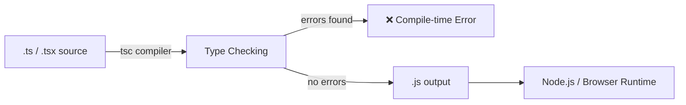
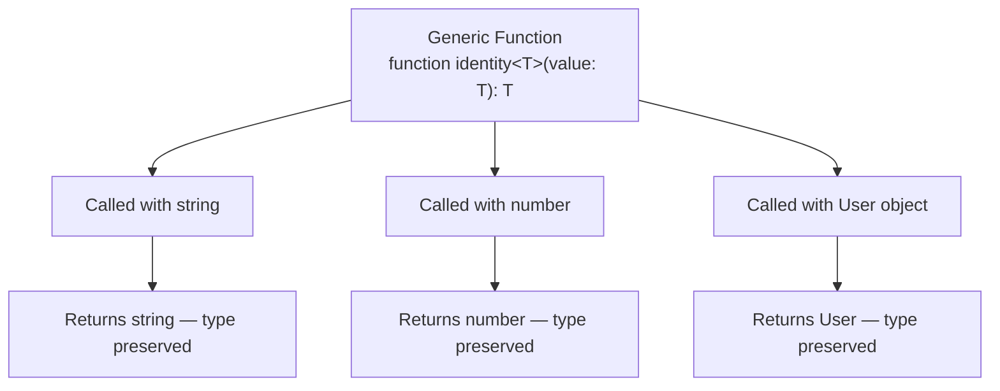

# Introduction to TypeScript

## 1. What is TypeScript?

TypeScript is an open-source language developed and maintained by Microsoft (first released in 2012). It is a **strict syntactical superset of JavaScript**, meaning every valid JavaScript program is also valid TypeScript — but TypeScript adds a **static type system** on top of it.

* **Architecture:** TypeScript code (`.ts`) does not run directly in browsers or Node.js. It is *compiled* (technically "transpiled") by the TypeScript Compiler (`tsc`) into plain JavaScript (`.js`), which then runs anywhere JavaScript runs.
* **Purpose:** It was built to solve the pain points of large-scale JavaScript applications — untyped variables, unpredictable runtime errors, and poor tooling support in big codebases.



Type errors are caught **before** the code ever runs — not discovered by a user in production.

---

## 2. Why TypeScript Over JavaScript?

| Feature | JavaScript | TypeScript |
| :--- | :--- | :--- |
| **Typing** | Dynamically typed | Statically typed (checked at compile time) |
| **Error Detection** | Mostly at runtime | Mostly at compile time |
| **Tooling** | Basic autocomplete | Rich IntelliSense, refactoring, inline docs |
| **Refactoring Safety** | Risky in large codebases | Safe — compiler flags broken references |
| **Learning Curve** | Lower | Slightly higher (worth it at scale) |
| **Output** | Runs natively | Compiles down to JavaScript |

### The JavaScript Problem

```javascript
function calculateTotal(price, quantity) {
  return price * quantity;
}

calculateTotal(10, "5");   // "5" is a string, but JS allows it
// Returns 50 due to coercion — but pass "abc" instead and you get NaN silently
```

### The TypeScript Fix

```typescript
function calculateTotal(price: number, quantity: number): number {
  return price * quantity;
}

calculateTotal(10, "5");   // ❌ Compile-time error: Argument of type 'string' 
                            //    is not assignable to parameter of type 'number'
```

TypeScript doesn't just catch *typos* — it catches **contract violations** between functions, objects, and modules across an entire codebase.

---

## 3. Setting Up TypeScript

```bash
# Install TypeScript globally or as a dev dependency
npm install typescript --save-dev

# Initialize a config file
npx tsc --init

# Compile a file
npx tsc index.ts

# Watch mode (recompiles on save)
npx tsc --watch
```

### Key `tsconfig.json` options worth knowing early

| Option | Purpose |
| :--- | :--- |
| `target` | Which JS version to compile down to (e.g., `ES2020`) |
| `strict` | Enables all strict type-checking options (highly recommended) |
| `module` | Module system used in output (`CommonJS`, `ESNext`, etc.) |
| `outDir` | Where compiled `.js` files are placed |
| `rootDir` | Where the compiler looks for `.ts` source files |
| `esModuleInterop` | Improves compatibility between CommonJS and ES modules |

> 💡 **Tip:** Always enable `"strict": true` on new projects. It forces disciplined typing habits that pay off enormously as a codebase grows.

---

## 4. The Type System

### 4.1 Primitive & Structural Types

```typescript
let age: number = 30;
let username: string = "sarah_dev";
let isActive: boolean = true;
let scores: number[] = [95, 88, 76];
let coordinates: [number, number] = [12.9, 77.6];   // Tuple — fixed length & order
```

### 4.2 The Special Types: `any`, `unknown`, `never`, `void`

These are frequently misunderstood, even by intermediate developers:

| Type | Meaning | Safe? |
| :--- | :--- | :--- |
| `any` | Opts *out* of type checking entirely | ⚠️ Avoid — defeats the purpose of TypeScript |
| `unknown` | Could be anything, but **must be narrowed** before use | ✅ Safe alternative to `any` |
| `void` | Function returns nothing | ✅ Normal, used on function signatures |
| `never` | Function never returns (throws, or infinite loop) | ✅ Used for exhaustiveness checks |

```typescript
function processInput(input: unknown) {
  if (typeof input === "string") {
    console.log(input.toUpperCase()); // ✅ narrowed to string, safe
  }
}

function fail(message: string): never {
  throw new Error(message);
}
```

### 4.3 Type Inference vs Explicit Typing

TypeScript infers types automatically where possible — you don't need to annotate everything.

```typescript
let count = 5;        // inferred as 'number', no annotation needed
count = "five";        // ❌ Error — inference still enforces the type
```

> Use explicit typing at **function boundaries** (parameters, return types) and let inference handle the rest. Over-annotating internal variables adds noise without benefit.

---

## 5. Interfaces vs Type Aliases

Both describe the *shape* of data, but they have important differences at an intermediate level.

```typescript
interface User {
  readonly id: number;        // cannot be reassigned after creation
  name: string;
  email?: string;              // optional property
}

type Point = {
  x: number;
  y: number;
};
```

| Capability | `interface` | `type` |
| :--- | :--- | :--- |
| Extending / merging | `extends` keyword, supports **declaration merging** | Uses intersections (`&`) |
| Unions | ❌ Cannot represent unions directly | ✅ `type Status = "active" \| "inactive"` |
| Primitives / tuples | ❌ Object shapes only | ✅ Can alias any type |
| Best for | Public API contracts, class shapes | Unions, complex compositions |

```typescript
interface Base { id: number }
interface Admin extends Base { role: "admin" }   // interface extension

type Shape = { kind: "circle"; radius: number } | { kind: "square"; side: number }; // union
```

> **Rule of thumb:** Use `interface` for objects/classes that might be extended by others; use `type` when you need unions, tuples, or mapped/conditional logic.

---

## 6. Functions — Advanced Typing

```typescript
// Optional & default parameters
function greet(name: string, greeting: string = "Hello"): string {
  return `${greeting}, ${name}!`;
}

// Rest parameters
function sum(...numbers: number[]): number {
  return numbers.reduce((total, n) => total + n, 0);
}

// Function overloading — multiple valid call signatures
function getValue(key: string): string;
function getValue(key: number): number;
function getValue(key: string | number): string | number {
  return typeof key === "string" ? `id-${key}` : key * 2;
}
```

Overloading lets the *caller* get precise return types depending on what they pass in, while a single implementation handles the logic internally.

---

## 7. Classes & Object-Oriented TypeScript

```typescript
abstract class Employee {
  protected constructor(
    public readonly id: number,
    private baseSalary: number
  ) {}

  abstract calculateBonus(): number;   // must be implemented by subclasses

  getSalary(): number {
    return this.baseSalary + this.calculateBonus();
  }
}

class Manager extends Employee {
  constructor(id: number, baseSalary: number, private teamSize: number) {
    super(id, baseSalary);
  }

  calculateBonus(): number {
    return this.teamSize * 500;
  }
}
```

| Modifier | Accessible From |
| :--- | :--- |
| `public` (default) | Anywhere |
| `private` | Only within the declaring class |
| `protected` | The class and its subclasses |
| `readonly` | Set once (in constructor), never reassigned |

> Note the **constructor shorthand** above (`public readonly id: number`) — TypeScript automatically declares and assigns the property, removing boilerplate.

---

## 8. Generics — Writing Reusable, Type-Safe Code

Generics let a function, interface, or class work with *any* type while still preserving type safety — instead of relying on `any`.



```typescript
function identity<T>(value: T): T {
  return value;
}

identity<string>("hello");   // T = string
identity<number>(42);        // T = number

// Generic interface
interface ApiResponse<T> {
  data: T;
  status: number;
  success: boolean;
}

const response: ApiResponse<User> = {
  data: { id: 1, name: "Sarah" },
  status: 200,
  success: true,
};

// Generic constraint — T must have a 'length' property
function logLength<T extends { length: number }>(item: T): void {
  console.log(item.length);
}
```

Generics are the backbone of type-safe API clients, reusable UI components, and testing utilities (Playwright's `Page`, `Locator`, and fixture types rely heavily on generics internally).

---

## 9. Union Types, Intersection Types & Narrowing

```typescript
type Status = "pending" | "success" | "error";   // Union — one of several literal values

type Timestamped = { createdAt: Date };
type Named = { name: string };
type Entity = Timestamped & Named;                // Intersection — combines both shapes
```

### Discriminated Unions (a key intermediate pattern)

```typescript
type Shape =
  | { kind: "circle"; radius: number }
  | { kind: "rectangle"; width: number; height: number };

function area(shape: Shape): number {
  switch (shape.kind) {
    case "circle":
      return Math.PI * shape.radius ** 2;      // narrowed to circle here
    case "rectangle":
      return shape.width * shape.height;        // narrowed to rectangle here
  }
}
```

The `kind` field acts as a **discriminant** — TypeScript uses it to narrow the union inside each `case`, giving full autocomplete and type safety per branch.

---

## 10. Utility Types

TypeScript ships with built-in generic types that transform existing types instead of writing them from scratch.

```typescript
interface Product {
  id: number;
  name: string;
  price: number;
  description: string;
}

type ProductPreview = Pick<Product, "id" | "name">;     // only id & name
type ProductUpdate  = Partial<Product>;                  // all properties optional
type ProductSummary = Omit<Product, "description">;      // everything except description
type ProductMap     = Record<number, Product>;           // { [id: number]: Product }
type ReadonlyProduct = Readonly<Product>;                 // all properties immutable
```

| Utility | What it does |
| :--- | :--- |
| `Partial<T>` | Makes all properties optional |
| `Required<T>` | Makes all properties mandatory |
| `Readonly<T>` | Makes all properties immutable |
| `Pick<T, K>` | Selects a subset of properties |
| `Omit<T, K>` | Excludes a subset of properties |
| `Record<K, V>` | Builds an object type with keys `K` and values `V` |
| `ReturnType<T>` | Extracts a function's return type |

---

## 11. Advanced Type Manipulation

### `keyof` and `typeof`

```typescript
interface User {
  id: number;
  name: string;
}

type UserKeys = keyof User;      // "id" | "name"

const config = { retries: 3, timeout: 5000 };
type Config = typeof config;      // { retries: number; timeout: number }
```

### Mapped Types

```typescript
type Optional<T> = {
  [K in keyof T]?: T[K];         // loops over every key of T, makes it optional
};
```

### Conditional Types

```typescript
type IsString<T> = T extends string ? "yes" : "no";

type A = IsString<string>;   // "yes"
type B = IsString<number>;   // "no"
```

Conditional and mapped types are what power many of the utility types shown in Section 10 — understanding them means you can build your own.

---

## 12. Modules

```typescript
// mathUtils.ts
export function add(a: number, b: number): number {
  return a + b;
}
export const PI = 3.14159;

// app.ts
import { add, PI } from "./mathUtils";
```

* Each file with a top-level `import`/`export` is treated as its own module scope.
* Prefer **named exports** for utilities (`export function ...`) and **default exports** sparingly, typically for a single primary class/component per file.

---

## 13. TypeScript in Real Projects

| Environment | Why TypeScript Helps |
| :--- | :--- |
| **Node.js / Express APIs** | Typed request/response bodies, safer refactors across routes |
| **React** | Typed props/state catch UI bugs before render |
| **Playwright** | Typed `Page`, `Locator`, and fixture objects give full autocomplete for selectors and actions, and catch broken Page Object Model references at compile time |

```typescript
// A typed Playwright Page Object Model example
import { Page, Locator } from "@playwright/test";

export class LoginPage {
  private readonly usernameInput: Locator;
  private readonly passwordInput: Locator;
  private readonly submitButton: Locator;

  constructor(private page: Page) {
    this.usernameInput = page.locator("#username");
    this.passwordInput = page.locator("#password");
    this.submitButton = page.locator("button[type=submit]");
  }

  async login(username: string, password: string): Promise<void> {
    await this.usernameInput.fill(username);
    await this.passwordInput.fill(password);
    await this.submitButton.click();
  }
}
```

Notice how every method signature declares exactly what it expects and returns — a huge advantage when a test suite grows to hundreds of specs across multiple contributors.

---

## 14. Best Practices

1. **Enable `strict` mode** from day one — retrofitting strictness onto a loose codebase is painful.
2. **Avoid `any`** — prefer `unknown` and narrow it, or define a proper type/interface.
3. **Type function boundaries explicitly**, let inference handle local variables.
4. **Prefer discriminated unions** over optional flags scattered across a type (`{ kind: "..." }` beats five optional booleans).
5. **Use utility types** (`Partial`, `Pick`, `Omit`) instead of duplicating interfaces with slight variations.
6. **Keep types close to their domain** — colocate a module's types with its implementation rather than one giant `types.ts` dump.
7. **Let the compiler do code review** — treat every `tsc` error as a real bug, not a formality to silence.
