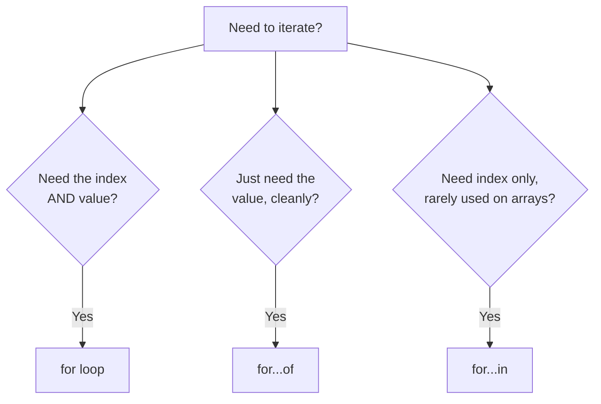
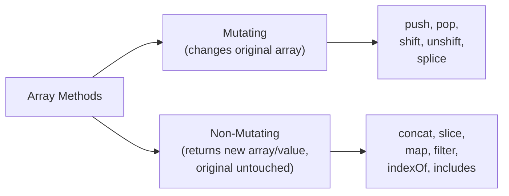

# TypeScript Arrays — Complete Guide

---

## 1. Arrays

- A special type of variable that can store **multiple values**, in an ordered, index-based list.
- Values can be all the **same type**, or a **mix of types** if explicitly allowed.

**Declaring an array — two main ways:**

```typescript
// Approach 1: Array literal syntax
let names: string[] = [];
names[0] = "john";
names[1] = "smith";
let names2: string[] = ["john", "smith", "peter", "scott"]; // direct init

// Approach 2: Generic Array<Type> syntax — same result, different style
let empNames: Array<string> = ["john", "smith", "peter", "scott"];
let empIds: Array<number> = [101, 102, 103, 104];
```

**Mixed and flexible types:**
```typescript
let data: Array<string | number> = ["john", "smith", 101, 102]; // union type — only string OR number
let data2: Array<any> = [1, "john", true, null];                 // 'any' allows literally anything (avoid where possible)
```

**Accessing elements:**
```typescript
console.log(names);     // ['john', 'smith', 'peter', 'scott']
console.log(names[1]);  // 'smith' — indexing starts at 0
console.log(names[4]);  // undefined — index out of bounds, no error thrown
```

- Accessing an out-of-bounds index does **not** throw an error — it silently returns `undefined`, which can hide bugs if not checked.
- `readonly` arrays (`readonly number[]`) prevent any modification after creation — useful for values that must never change.

---

## 2. Array Iterations

Multiple ways exist to loop through an array — each suited to different needs.

```typescript
// for loop — gives index, most control
for (let i = 0; i < empNames.length; i++) {
  console.log(empNames[i]);
}

// for...in loop — gives the index (as a string), used less often for arrays
for (let i in empIds) {
  console.log(empIds[i]); // 'i' is the index
}

// for...of loop — gives the actual value directly, cleanest for simple iteration
for (let element of data) {
  console.log(element); // 'element' is the value itself
}
```



- `for...in` iterates over **keys/indices** — technically works on arrays but is more suited to objects; using it on arrays can behave unexpectedly if the array has extra custom properties.
- `for...of` is generally preferred for arrays since it's cleaner and gives values directly.

---

## 3. Array Methods

Array methods fall into two important categories — knowing the difference is a common interview point.



### Mutating Methods (change the original array)

| Method | Description | Syntax | Example Result |
|---|---|---|---|
| `push()` | Adds one or more elements to the **end** | `array.push(el1, el2)` | `[1,2,3].push(4,5)` → `[1,2,3,4,5]` |
| `pop()` | Removes and returns the **last** element | `array.pop()` | `['a','b','c'].pop()` → returns `'c'`, array becomes `['a','b']` |
| `shift()` | Removes and returns the **first** element | `array.shift()` | `[1,2,3].shift()` → returns `1`, array becomes `[2,3]` |
| `unshift()` | Adds one or more elements to the **beginning** | `array.unshift(el)` | `['b','c'].unshift('a')` → `['a','b','c']` |
| `splice()` | Adds/removes elements at **any position** | `array.splice(start, deleteCount, ...items)` | `['a','b','c'].splice(1,1)` → removes `'b'` |

```typescript
let fruits: string[] = ['apple', 'banana', 'cherry'];
fruits.splice(1, 1);                 // remove 1 element at index 1 → ['apple', 'cherry']
fruits.splice(1, 0, 'orange');       // insert at index 1, delete 0 → ['apple', 'orange', 'cherry']
```

### Non-Mutating Methods (original array stays untouched)

| Method | Description | Syntax | Return Type |
|---|---|---|---|
| `concat()` | Combines two or more arrays into a **new** array | `array.concat(other)` | `T[]` |
| `slice()` | Extracts a section without modifying original (`end` is **exclusive**) | `array.slice(start, end)` | `T[]` |
| `indexOf()` | Returns the index of the first match, or `-1` if not found | `array.indexOf(value)` | `number` |
| `includes()` | Checks whether a value exists | `array.includes(value)` | `boolean` |
| `toString()` | Converts array to a comma-separated string | `array.toString()` | `string` |

```typescript
let a: number[] = [1, 2];
let b: number[] = [3, 4];
let combined: number[] = a.concat(b);            // [1, 2, 3, 4] — a and b unchanged

let fruits: string[] = ['kiwi', 'apple', 'banana', 'mango'];
let selected: string[] = fruits.slice(1, 3);     // ['apple', 'banana'] — endIndex excluded
```

### Iteration & Transformation Methods

| Method | Description | Return Type |
|---|---|---|
| `forEach()` | Runs a function per element — for **side effects** only | `void` |
| `map()` | Returns a **new array** with transformed elements | `T[]` (same length) |
| `filter()` | Returns a **new array** with only matching elements | `T[]` (subset) |
| `reduce()` | Combines all elements into a **single value** | Any |
| `some()` | `true` if **at least one** element matches | `boolean` |
| `every()` | `true` if **all** elements match | `boolean` |

```typescript
let nums: number[] = [1, 2, 3, 4];
let squares: number[] = nums.map((n) => n * n);          // [1, 4, 9, 16]
let evens: number[] = nums.filter((n) => n % 2 === 0);   // [2, 4]
let total: number = nums.reduce((sum, n) => sum + n, 0); // 10
let allEven: boolean = nums.every((n) => n % 2 === 0);    // false
```

- These are all **non-mutating** — they never change the original array, they return something new instead.
- Knowing which methods mutate vs which don't is critical for avoiding unexpected bugs — e.g. `sort()` and `reverse()` are also mutating, a common trap.

---

## 4. Array Functions

Arrays can be passed into functions, and functions can return arrays — this is fundamental to writing reusable logic.

**Passing an array to a function (searching):**
```typescript
function search(ele: number, arr: number[]): boolean {
  for (let i = 0; i < arr.length; i++) {
    if (arr[i] === ele) {
      return true; // element found
    }
  }
  return false; // element not found
}

let arr: number[] = [10, 20, 30, 40, 50];
console.log(search(20, arr));  // true
console.log(search(100, arr)); // false
```

**Function returning a modified array:**
```typescript
function capitalizeWords(arr: string[]): string[] {
  let result: string[] = [];
  for (let i = 0; i < arr.length; i++) {
    result[i] = arr[i].toUpperCase();
  }
  return result;
}

let words: string[] = ["hello", "world", "typescript"];
console.log(capitalizeWords(words)); // ["HELLO", "WORLD", "TYPESCRIPT"]
```

**Generic array functions** — work with an array of *any* type, while keeping type safety (avoiding `any`):
```typescript
function firstElement<T>(arr: T[]): T {
  return arr[0];
}

firstElement<number>([1, 2, 3]);  // returns number
firstElement<string>(["a", "b"]); // returns string
```

- Typing both the **parameter** (`arr: number[]`) and the **return type** (`: boolean`, `: string[]`) ensures the function's contract is enforced by the compiler — mismatched calls are caught before runtime.
- Prefer writing pure functions when possible — functions that don't mutate the array passed in, and instead return a new one (matches the non-mutating method philosophy above).

---

## Q&A

**Q1. What are the two main ways to declare an array in TypeScript?**

A:
- Array literal syntax: `let names: string[] = [];`
- Generic syntax: `let names: Array<string> = [];`
- Both are functionally identical — literal syntax is more common for simple types.

**Q2. What happens when you access an array index that doesn't exist?**

A:
- TypeScript/JavaScript returns `undefined`.
- No error is thrown, which can silently hide bugs if the result isn't checked.

**Q3. What is the difference between `for...in` and `for...of` when used on an array?**

A:
- `for...in` iterates over the **indices** (as strings), and is more suited to objects.
- `for...of` iterates over the **values** directly, and is generally preferred for arrays.
- Using `for...in` on arrays can behave unexpectedly if the array has extra custom properties.

**Q4. What is the difference between a mutating and a non-mutating array method?**

A:
- A mutating method changes the original array directly — e.g. `push()`, `pop()`, `splice()`.
- A non-mutating method leaves the original array untouched and returns a new array or value — e.g. `map()`, `filter()`, `slice()`.
- Knowing this distinction avoids accidental side effects in code that assumes an array is unchanged.

**Q5. What is the difference between `slice()` and `splice()`?**

A:
- `slice()` extracts a portion of the array **without modifying** the original; the end index is exclusive.
- `splice()` **modifies** the original array — it can remove and/or insert elements at a given position.
- Their similar names are a common source of confusion in interviews.

**Q6. What does `indexOf()` return if the value isn't found in the array?**

A:
- It returns `-1`.
- This is why checking `indexOf(value) !== -1` is a common pattern to test for existence (though `includes()` is more direct for that purpose).

**Q7. How would you type a function that takes an array of numbers and returns whether a specific number exists in it?**

A:
- Parameter type: `arr: number[]`, plus the target value `ele: number`.
- Return type: `boolean`.
- Example signature: `function search(ele: number, arr: number[]): boolean`.

**Q8. Why might you prefer `map()` over a manual `for` loop when transforming an array?**

A:
- `map()` is more concise and clearly signals "I'm transforming this array" to readers.
- It automatically returns a new array without manually managing an index or a result array.
- The trade-off: a manual loop offers more control (e.g. early exit with `break`), which `map()` doesn't support.

**Q9. Explain how `reduce()` could be used to flatten an array of arrays into a single array.**

A:
- Pass an empty array `[]` as the starting accumulator value.
- Inside the reducer, concatenate each sub-array onto the accumulator using `concat()` or the spread operator.
- Return the accumulator each time so it carries forward to the next iteration.

**Q10. What is a generic array function, and why is it preferred over using `any[]`?**

A:
- A generic function uses a type parameter (e.g. `<T>`) so it works with an array of any type while preserving that specific type.
- Using `any[]` disables type checking entirely — mismatched usage wouldn't be caught by the compiler.
- Generics keep both flexibility and type safety, e.g. `function firstElement<T>(arr: T[]): T`.

**Q11. In a real project, why is it risky to pass an array into a function that internally uses mutating methods like `push()` or `splice()`?**

A:
- The original array outside the function gets modified as a side effect, since arrays are passed by reference in JavaScript/TypeScript.
- This can cause unexpected bugs elsewhere in the code that assumed the array was unchanged.
- Safer practice: clone the array first (e.g. `[...arr]`) before mutating, or use non-mutating methods that return a new array instead.

**Q12. How would you decide between `forEach()` and `map()` when the callback needs to run for every element but you don't need the result?**

A:
- Use `forEach()` — it clearly communicates that no new array is expected.
- Using `map()` here would still allocate a new array in memory that's never used, wasting resources and confusing readers about intent.
