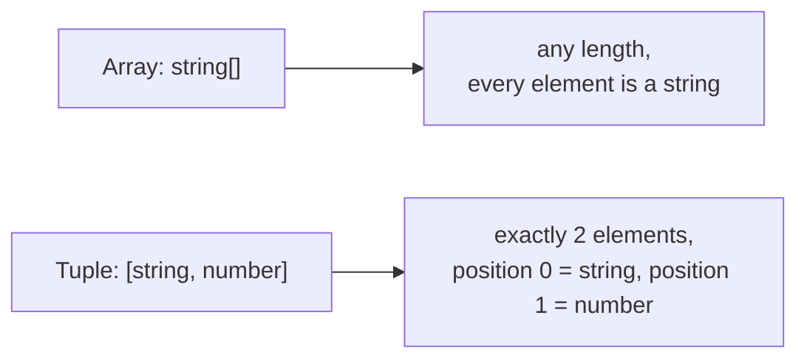
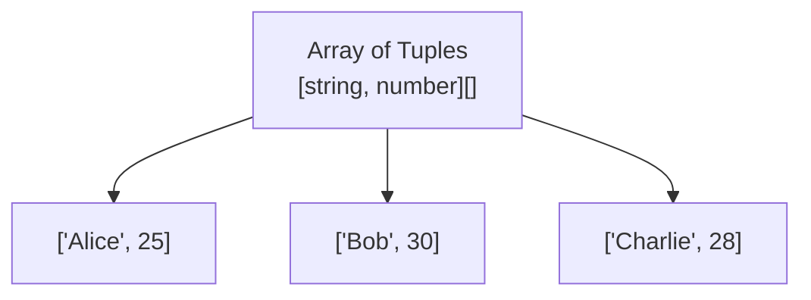

# TypeScript Tuples — Guide

---

## 1. Tuples

- A **fixed-length array** where **each element has its own specific type**, tied to its position.
- Helps store multiple fields of **different data types** together, in one structured value.

```typescript
let person: [string, number] = ["Alice", 25];
console.log(person[0]); // Output: Alice
console.log(person[1]); // Output: 25
```

- Unlike a regular array (where every element shares one type), a tuple locks in **both the length and the type at each position**.



- Assigning the wrong type to a position, or the wrong number of elements, is caught at **compile time**.

```typescript
let person: [string, number] = [25, "Alice"]; // ❌ error — types in wrong order
let person2: [string, number] = ["Alice"];     // ❌ error — missing the number
```

**Optional elements** — a position can be marked optional with `?`:
```typescript
let point: [number, number, number?] = [10, 20]; // third element optional
```

**Readonly tuples** — prevent any element from being reassigned after creation:
```typescript
let fixedPerson: readonly [string, number] = ["Alice", 25];
fixedPerson[0] = "Bob"; // ❌ compile-time error
```

**Named tuple members** — labels for readability only, no effect on runtime behavior:
```typescript
let employee: [id: number, name: string] = [101, "John"];
```

**Rest elements in tuples** — combine a fixed "header" with a flexible-length "tail":
```typescript
let scoreEntry: [string, ...number[]] = ["Math", 90, 85, 88]; // subject + any number of scores
```

**Destructuring a tuple** — a common, clean way to read tuple values into separate variables:
```typescript
let [name, age] = person; // name = "Alice", age = 25
```

- Tuples are commonly used for **fixed-shape data**: coordinate pairs, RGB colors, or a function returning multiple values in a `[value, error]` style pattern.

---

## 2. Tuple Array (Array of Tuples)

- An array where **every element is itself a tuple** — useful for representing key-value pairs, paired records, or fixed-shape rows of data.

```typescript
let employees: [string, number][] = [
  ["Alice", 25],
  ["Bob", 30],
  ["Charlie", 28],
];
```



**Accessing elements:**
```typescript
console.log(employees[0]);     // ['Alice', 25] — the full tuple
console.log(employees[0][0]);  // 'Alice' — first element of the first tuple
console.log(employees[1][1]);  // 30 — second element of the second tuple
```

**Iterating over an array of tuples:**
```typescript
for (let [name, age] of employees) {
  console.log(`${name} is ${age} years old`);
}
```

- This is exactly the pattern used internally by `Object.entries()` and `Map` — each entry is a `[key, value]` tuple, so iterating a `Map` naturally gives you an array-of-tuples-style structure.

```typescript
const ageMap = new Map<string, number>([
  ["Alice", 25],
  ["Bob", 30],
]);

for (const [name, age] of ageMap) {
  console.log(name, age); // Map iterates internally as [key, value] tuples
}
```

- An array of tuples combines **array flexibility** (any length, sortable, iterable) with **tuple precision** (each entry has a guaranteed, fixed shape).
- Common real-world use: representing rows of tabular data where each row has a known, fixed structure — e.g. `[id, name, salary][]`.

---

## Q&A

**Q1. What is a tuple in TypeScript?**

A:
- A fixed-length array where each position has its own specific type.
- Used to group multiple values of different types together in one structured value.
- Example: `[string, number]` always expects exactly a string followed by a number.

**Q2. How is a tuple different from a regular array?**

A:
- A regular array can be any length, with every element sharing the same type (or a union type).
- A tuple has a fixed length, and each position has its own distinct type.
- Mismatched type or length in a tuple is caught at compile time.

**Q3. What happens if you assign the wrong type to a tuple position?**

A:
- TypeScript raises a compile-time error.
- This applies both to using the wrong type at a position, and to providing too few or too many elements.

**Q4. How do you make a tuple element optional?**

A:
- Add a `?` after the type at that position — e.g. `[number, number, number?]`.
- This allows the tuple to be created with or without that final element.

**Q5. What is a readonly tuple, and why would you use one?**

A:
- A tuple declared with the `readonly` modifier, which prevents any element from being reassigned after creation.
- Useful for fixed values that should never change, like constant coordinate pairs.

**Q6. What are named tuple members, and do they affect runtime behavior?**

A:
- Syntax like `[id: number, name: string]` attaches readable labels to each position.
- They exist purely for developer readability and editor tooltips.
- They have no effect on how the tuple behaves at runtime — it's still accessed by index.

**Q7. What is an array of tuples, and when would you use one?**

A:
- An array where each element is itself a tuple, e.g. `[string, number][]`.
- Useful for representing paired or row-like data — key-value pairs, fixed-shape records, or tabular rows.

**Q8. How do you access a specific value inside an array of tuples?**

A:
- Use double indexing: first the array index, then the tuple position.
- Example: `employees[0][1]` accesses the second element of the first tuple.
- Alternatively, destructure during iteration: `for (let [name, age] of employees) { ... }`.

**Q9. How does an array of tuples relate to how `Map` and `Object.entries()` work internally?**

A:
- `Object.entries()` returns an array of `[key, value]` tuples.
- Iterating a `Map` also yields `[key, value]` tuples, one per entry.
- Both are practical, built-in examples of the array-of-tuples pattern in everyday TypeScript code.

**Q10. What is a rest element in a tuple, and what problem does it solve?**

A:
- Syntax like `[string, ...number[]]` fixes the type of the first position while allowing any number of additional elements of a specified type afterward.
- Solves the problem of needing a fixed "header" value followed by a variable-length "body" — e.g. a subject name followed by any number of scores.

**Q11. In a large codebase, when would you choose an array of tuples over an array of objects for the same data?**

A:
- Array of tuples: more compact, useful for simple, order-dependent data where field names add little value (e.g. quick lookups, small utility data).
- Array of objects: better when fields benefit from clear naming, or the data may grow to include more properties over time — much easier to read and maintain at scale.
- Tuples trade readability for conciseness; objects trade conciseness for clarity and extensibility.

**Q12. Why can destructuring a tuple be considered safer than destructuring a regular array?**

A:
- With a tuple, TypeScript knows the exact type at each position, so destructured variables get precise types automatically.
- With a regular array, all elements share one type (or a union), so destructured variables can only be typed as generally as the array itself.
- This makes tuples better suited for structured, fixed-shape data where each position has clear meaning.
