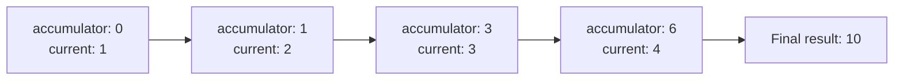
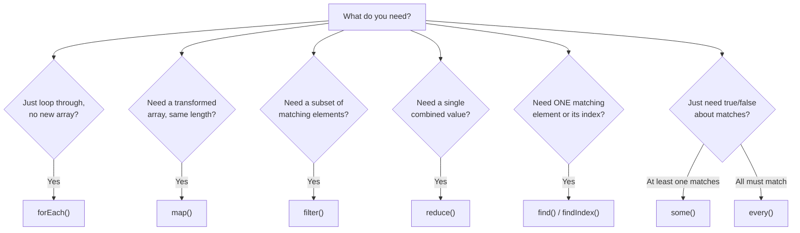

# TypeScript Array Methods — Guide

---

## 1. `forEach()`

- Executes a function once for **each array element** — used purely for iteration (going through elements one by one).
- Does **not** return a new array — it returns `void` (nothing usable).

```typescript
const nums: number[] = [1, 2, 3];

nums.forEach((element: number, index: number) => {
  console.log(index, element);
});
```

- Best used for **side effects** (an action that doesn't produce a new value, like logging, updating a UI element, or pushing into an external array) — not for transforming data.
- Cannot be stopped early with `break` — since it's a function call, not a real loop (`return` inside it only skips the current iteration, like `continue`).

---

## 2. `map()`

- Creates a **new array** with the results of calling a function on **each element**.
- The new array is always the **same length** as the original.

```typescript
const nums: number[] = [1, 2, 3];
const doubled: number[] = nums.map((n: number) => n * 2);
// doubled = [2, 4, 6]
```

- Original array is **never modified** — `map()` always returns a fresh array (this is called **immutability** — the original data stays untouched).
- The return type is inferred automatically based on what the callback returns — e.g. mapping numbers to strings gives back a `string[]`.

```typescript
const labels: string[] = nums.map((n: number) => `Item ${n}`);
```

---

## 3. `filter()`

- Creates a **new array** containing only the elements that **pass a test** (a condition function that returns `true` or `false`).
- The new array can be **shorter** than the original — only matching elements are kept.

```typescript
const nums: number[] = [1, 2, 3, 4, 5];
const evens: number[] = nums.filter((n: number) => n % 2 === 0);
// evens = [2, 4]
```

- Unlike `map()`, `filter()` doesn't transform values — it only **decides which ones to keep**.
- `map()` and `filter()` are often chained together — filter first, then transform what's left.

```typescript
const result: string[] = nums
  .filter((n: number) => n % 2 === 0)
  .map((n: number) => `Even: ${n}`);
```

---

## 4. `reduce()`

- Executes a **reducer function** on each element, resulting in a **single output value** (accumulating results into one final value, like a running total).
- Takes two main arguments: the reducer function, and an optional **starting value** for the accumulator.

```typescript
const nums: number[] = [1, 2, 3, 4];
const total: number = nums.reduce(
  (accumulator: number, currentValue: number) => accumulator + currentValue,
  0   // starting value of accumulator
);
// total = 10
```



- The most **flexible** array method — can be used to sum values, find a max/min, group data, flatten arrays, or even rebuild an object.
- If you skip the starting value, the reducer uses the **first array element** as the initial accumulator, and starts looping from the second element — this can cause bugs on empty arrays, so it's safer to always pass a starting value.

---

## 5. `some()`

- Tests whether **at least one** element passes the provided condition function.
- Returns a `boolean` — `true` as soon as one match is found, `false` if none match.

```typescript
const nums: number[] = [1, 3, 5, 8];
const hasEven: boolean = nums.some((n: number) => n % 2 === 0);
// hasEven = true (because of 8)
```

- **Stops checking as soon as a match is found** (called **short-circuiting**) — it doesn't check the remaining elements once `true` is confirmed, which makes it efficient.

---

## 6. `every()`

- Tests whether **all** elements pass the provided condition function.
- Returns a `boolean` — `true` only if every single element matches; `false` the moment one fails.

```typescript
const nums: number[] = [2, 4, 6, 8];
const allEven: boolean = nums.every((n: number) => n % 2 === 0);
// allEven = true
```

- Like `some()`, it **short-circuits** — stops checking as soon as one element fails the condition.
- `some()` and `every()` are logical opposites in spirit: "does at least one match?" vs "do all match?"

---

## 7. Other Important Methods (Bonus — Interview Relevant)

**`find()`** — returns the **first element** that matches a condition, or `undefined` if none match (unlike `filter()`, which returns *all* matches in an array).

```typescript
const found: number | undefined = nums.find((n: number) => n > 4);
```

**`findIndex()`** — same as `find()`, but returns the **index** of the first match instead of the value itself; returns `-1` if no match is found.

```typescript
const index: number = nums.findIndex((n: number) => n > 4);
```

**`includes()`** — checks whether an array **contains a specific value**, returns a `boolean`. Simpler than `some()` when you just need to check for existence of a value, not a condition.

```typescript
const hasThree: boolean = nums.includes(3);
```

---

## Choosing the Right Method



---

## Comparison Table

| Method | Description | Syntax | Return Type |
|---|---|---|---|
| `forEach()` | Executes a function once for each array element (used for iteration) | `array.forEach(function(element, index, array) {})` | `void` (no return value) |
| `map()` | Creates a new array with results of calling a function on each element | `array.map(function(element, index, array) {})` | `T[]` (same length) |
| `filter()` | Creates a new array with elements that pass the test function | `array.filter(function(element, index, array) {})` | `T[]` (subset) |
| `reduce()` | Executes a reducer function on each element, resulting in a single output value | `array.reduce(function(accumulator, currentValue, index, array) {})` | Any (based on accumulator) |
| `some()` | Tests whether at least one element passes the condition | `array.some(function(element, index, array) {})` | `boolean` |
| `every()` | Tests whether all elements pass the condition | `array.every(function(element, index, array) {})` | `boolean` |
| `find()` | Returns the first matching element | `array.find(function(element, index, array) {})` | `T \| undefined` |
| `findIndex()` | Returns the index of the first matching element | `array.findIndex(function(element, index, array) {})` | `number` (`-1` if none) |
| `includes()` | Checks if a value exists in the array | `array.includes(value)` | `boolean` |

**Notes:**
- `forEach()` is purely for side effects (like logging) — it **doesn't return anything**.
- `map()` transforms data and **returns a new array** of the same length.
- `filter()` is used when you want to keep certain elements based on a condition.
- `reduce()` is powerful and used to accumulate values (e.g. sum, average, object merging).
- `some()` returns `true` if **any** element matches the condition.
- `every()` returns `true` only if **all** elements match the condition.

---

## Q&A

**Q1. What does `forEach()` return, and what is it typically used for?**

A:
- It returns `void` — nothing usable.
- Used purely for side effects, like logging or updating something outside the array.
- Not used for transforming or filtering data.

**Q2. What is the difference between `map()` and `forEach()`?**

A:
- `map()` returns a new array of the same length, built from the callback's return values.
- `forEach()` returns nothing and is only for running code per element.
- Using `map()` when you don't need the returned array is considered a bad practice — use `forEach()` instead.

**Q3. How does `filter()` differ from `map()`?**

A:
- `filter()` decides which elements to **keep**, based on a true/false condition.
- `map()` transforms **every** element's value, keeping the same array length.
- `filter()`'s result can be shorter than the original array; `map()`'s result is always the same length.

**Q4. What does `reduce()` do, and what are its two main arguments?**

A:
- It runs a reducer function across the array, combining values into a single final result.
- First argument: the reducer callback `(accumulator, currentValue) => ...`.
- Second argument: the optional starting value for the accumulator.

**Q5. What is the difference between `some()` and `every()`?**

A:
- `some()` returns `true` if **at least one** element matches the condition.
- `every()` returns `true` only if **all** elements match the condition.
- Both stop checking early once the result is determined (short-circuiting).

**Q6. What happens if you call `reduce()` on an empty array without a starting value?**

A:
- TypeScript/JavaScript throws a `TypeError`, since there's no initial value to start accumulating from.
- Always passing a starting value avoids this edge case.

**Q7. What is the difference between `find()` and `filter()`?**

A:
- `find()` returns the first matching element only (or `undefined` if none match).
- `filter()` returns an array of **all** matching elements (possibly empty).
- Use `find()` when you expect at most one relevant match.

**Q8. Why might using `map()` for a task that doesn't need a new array be considered bad practice?**

A:
- `map()` always allocates a new array in memory, even if the result is discarded.
- This wastes memory and signals unclear intent to other developers reading the code.
- `forEach()` communicates "I'm just iterating" more clearly when no new array is needed.

**Q9. How would you use `reduce()` to group an array of objects by a property (e.g. grouping users by role)?**

A:
- Pass an empty object `{}` as the starting value for the accumulator.
- Inside the reducer, check if the current item's group key already exists on the accumulator.
- If not, initialize it as an empty array; then push the current item into that group.
- Return the accumulator each time so it carries forward to the next iteration.

**Q10. Explain short-circuiting in `some()` and `every()`, and why it matters for performance.**

A:
- `some()` stops as soon as it finds one element that satisfies the condition — it does not check the rest.
- `every()` stops as soon as it finds one element that fails the condition.
- This matters for performance on large arrays — avoiding unnecessary checks once the result is already determined.

**Q11. In a real-world scenario, how would you chain `filter()`, `map()`, and `reduce()` together, and why is order important?**

A:
- Typical chain: `filter()` first to narrow down relevant elements, then `map()` to transform them, then `reduce()` to combine into a final result.
- Filtering first reduces the amount of data the later steps need to process — better performance on large datasets.
- Reordering (e.g. mapping before filtering) can still work, but may do unnecessary transformation work on elements that get filtered out later.

**Q12. What's the key difference between `includes()` and `some()`, and when would you choose one over the other?**

A:
- `includes()` checks for the existence of an exact value.
- `some()` checks for the existence of any element matching a custom condition (a function), not just an exact value.
- Choose `includes()` for simple value checks; choose `some()` when the check involves logic beyond equality (e.g. checking objects by a property).
