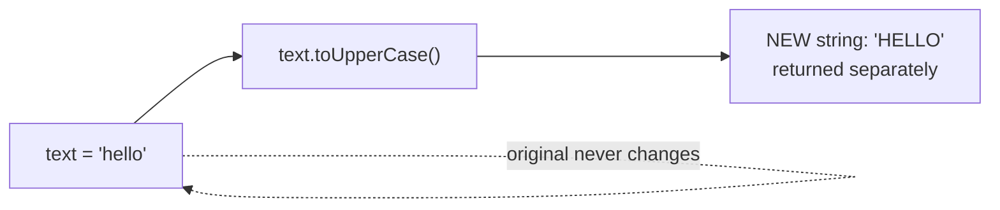
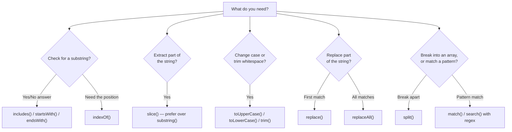

# TypeScript Strings — Guide

---

## 1. String Basics

- A **string** represents text data — a sequence of characters.
- Can be written three ways: single quotes, double quotes, or backticks.

```typescript
let a: string = 'Hello';
let b: string = "Hello";
let c: string = `Hello`;
```

- All three produce the exact same runtime value — the choice is purely stylistic, though backticks unlock extra features (covered in the next section).
- TypeScript's `string` (lowercase) is the **primitive** type — this is what you should always use for annotations. There's also a `String` (capital S) object wrapper type, which exists mainly for legacy reasons; annotating a variable as `String` is almost always a mistake, since it refers to a boxed object rather than the raw primitive, and comparisons between the two can behave unexpectedly.

```typescript
let good: string = "text";        // ✅ correct — primitive
let risky: String = new String("text"); // ⚠️ avoid — object wrapper, not a primitive
```

---

## 2. Multiline Strings & Template Literals

- Written with **backticks** (`` ` ``) instead of quotes.
- Allow **embedded expressions** using `${...}` — this is called **string interpolation**.
- Allow the string to naturally **span multiple lines**, without needing manual newline characters.

```typescript
let name: string = "Sarah";
let greeting: string = `Hello, ${name}!`;         // interpolation
let multiline: string = `Line one
Line two
Line three`;                                       // spans multiple lines directly
```

- Before template literals existed, achieving the same result required string concatenation with `+` and explicit `\n` characters for line breaks — template literals replace both needs at once.

```typescript
// Old way
let old = "Hello, " + name + "!\nWelcome back.";

// Template literal way — cleaner, less error-prone
let modern = `Hello, ${name}!
Welcome back.`;
```

- `${...}` can hold **any valid expression**, not just variables — function calls, arithmetic, ternaries, and even nested template literals.

```typescript
let price: number = 250;
let summary: string = `Total: $${price * 1.18} (incl. tax)`;
```

- A more advanced feature: **tagged templates** — a function placed directly before a template literal, which receives the string pieces and interpolated values separately, letting you customize how the final string is built (used in libraries like styled-components).

```typescript
function shout(strings: TemplateStringsArray, ...values: string[]): string {
  return strings.raw.join("") + "!!!";
}
shout`Hello ${name}`; // the tag function controls the final output
```

---

## 3. String Immutability

- Once a string is created, it **cannot be changed in place** — every string method that appears to "modify" a string actually **returns a brand new string**, leaving the original untouched.

```typescript
let text: string = "hello";
text[0] = "H";               // ❌ has no effect — silently fails, not even an error
console.log(text);           // still "hello"

let newText: string = text.toUpperCase(); // creates a NEW string
console.log(text);           // "hello" — unchanged
console.log(newText);        // "HELLO" — the new one
```



- Why this matters practically: if you call a string method and **don't capture the return value**, you've done nothing — a very common beginner mistake.

```typescript
let s: string = "hello";
s.toUpperCase();      // ❌ return value discarded — s is still "hello"
s = s.toUpperCase();  // ✅ correctly reassigned — s is now "HELLO"
```

- The reason strings are immutable (rather than mutable like arrays) ties back to how the language manages memory: since strings are used constantly and compared often, treating them as fixed, unchangeable values allows the engine to safely **reuse identical strings in memory** instead of duplicating them (a technique sometimes called string interning). If strings were mutable, changing one string could unexpectedly affect every other variable secretly sharing the same memory — immutability removes that danger entirely.

---

## 4. String Methods

### Reading & Searching

| Method | Description | Example |
|---|---|---|
| `.length` | Number of characters (a property, not a method — no `()`) | `"hello".length` → `5` |
| `charAt(i)` | Character at index `i` | `"hello".charAt(1)` → `"e"` |
| `[i]` | Character at index `i` (bracket access, more common) | `"hello"[1]` → `"e"` |
| `indexOf(sub)` | Index of first occurrence, or `-1` if not found | `"hello".indexOf("l")` → `2` |
| `lastIndexOf(sub)` | Index of last occurrence | `"hello".lastIndexOf("l")` → `3` |
| `includes(sub)` | Whether a substring exists | `"hello".includes("ell")` → `true` |
| `startsWith(sub)` | Whether the string begins with a value | `"hello".startsWith("he")` → `true` |
| `endsWith(sub)` | Whether the string ends with a value | `"hello".endsWith("lo")` → `true` |

### Extracting & Transforming

| Method | Description | Example |
|---|---|---|
| `slice(start, end)` | Extracts a section; `end` exclusive; accepts negative indices | `"hello".slice(1, 3)` → `"el"` |
| `substring(start, end)` | Like `slice()`, but negative indices are treated as `0` | `"hello".substring(1, 3)` → `"el"` |
| `toUpperCase()` | Converts to uppercase | `"hi".toUpperCase()` → `"HI"` |
| `toLowerCase()` | Converts to lowercase | `"HI".toLowerCase()` → `"hi"` |
| `trim()` | Removes whitespace from both ends | `"  hi  ".trim()` → `"hi"` |
| `trimStart()` / `trimEnd()` | Removes whitespace from one end only | `"  hi".trimStart()` → `"hi"` |
| `replace(a, b)` | Replaces the **first** match of `a` with `b` | `"hello".replace("l", "L")` → `"heLlo"` |
| `replaceAll(a, b)` | Replaces **all** matches of `a` with `b` | `"hello".replaceAll("l", "L")` → `"heLLo"` |
| `concat(str2)` | Joins strings together (rarely used — `+` or template literals are preferred) | `"foo".concat("bar")` → `"foobar"` |
| `repeat(n)` | Repeats the string `n` times | `"ab".repeat(3)` → `"ababab"` |
| `padStart(len, char)` | Pads the start until reaching a target length | `"5".padStart(3, "0")` → `"005"` |
| `padEnd(len, char)` | Pads the end until reaching a target length | `"5".padEnd(3, "0")` → `"500"` |

### Splitting & Joining

| Method | Description | Example |
|---|---|---|
| `split(separator)` | Splits a string into an **array** of substrings | `"a,b,c".split(",")` → `["a","b","c"]` |
| `Array.join(separator)` | The reverse — joins an array back into a string (an array method, listed here for the pairing) | `["a","b"].join("-")` → `"a-b"` |

### Pattern Matching (Regular Expressions)

| Method | Description | Example |
|---|---|---|
| `match(regex)` | Returns matches against a regular expression, or `null` | `"abc123".match(/\d+/)` → `["123"]` |
| `matchAll(regex)` | Returns all matches (as an iterator), for global patterns | `[..."a1b2".matchAll(/\d/g)]` → all digit matches |
| `search(regex)` | Returns the index of the first match, or `-1` | `"abc123".search(/\d/)` → `3` |

- `slice()` vs `substring()` is a classic mix-up: `slice(-2)` correctly grabs the last two characters by wrapping negative indices from the end, while `substring(-2)` treats any negative number as `0`, silently giving a completely different result. This makes `slice()` generally the safer default choice.

```typescript
"hello".slice(-2);     // "lo" — negative index wraps from the end
"hello".substring(-2); // "hello" — negative treated as 0, returns the whole string
```

---

## 5. Other Important String Topics

### Escape Characters
- Special character sequences starting with `\`, used to represent characters that would otherwise be hard or impossible to type directly.

```typescript
let quote: string = "She said \"hello\"";  // \" — literal double quote
let path: string = "C:\\Users\\file";       // \\ — literal backslash
let tabbed: string = "Name:\tAlice";        // \t — tab character
let newline: string = "Line1\nLine2";       // \n — line break
```

### String Comparison
- Strings are compared **lexicographically** (character by character, based on character codes) when using `<`, `>`, `<=`, `>=`.

```typescript
console.log("apple" < "banana"); // true — 'a' comes before 'b'
console.log("Apple" < "apple");  // true — uppercase letters have lower character codes than lowercase
```

- This means comparisons are **case-sensitive** by default — `"Apple"` and `"apple"` are treated as different values entirely, which can produce unexpected sorting or matching results if not accounted for.
- Equality (`===`) compares strings by their full character content, not by memory reference — two separately created strings with identical characters are still equal.

### Type Coercion with Strings
- The `+` operator is **overloaded**: if either operand is a string, `+` performs concatenation instead of numeric addition — this is one of the most common sources of unexpected bugs when mixing types carelessly.

```typescript
console.log(1 + 2);       // 3 — both numbers, numeric addition
console.log("1" + 2);     // "12" — string present, coerced to concatenation
console.log(1 + 2 + "3"); // "33" — left-to-right: 1+2=3 (number), then 3+"3"="33"
```

### Converting Between Strings and Numbers
```typescript
let numFromStr: number = Number("42");     // 42
let numFromStr2: number = parseInt("42px"); // 42 — parses leading digits, ignores rest
let strFromNum: string = (42).toString();   // "42"
let strFromNum2: string = `${42}`;          // "42" — template literal conversion
```
- `Number()` fails strictly — any non-numeric leftover characters produce `NaN`. `parseInt()`/`parseFloat()` are more lenient, parsing as far as they can and ignoring the rest, which can hide input errors if not validated carefully.

```typescript
Number("42px");     // NaN — fails entirely due to trailing text
parseInt("42px");   // 42 — parses only the leading digits
```

### String Literal Types
- Beyond the general `string` type, TypeScript allows restricting a variable to one **specific** string value, or a fixed set of them.

```typescript
let status: "success" | "error" | "pending";
status = "success"; // ✅
// status = "done";  // ❌ Error — not one of the allowed literal values
```
- This is the mechanism behind **discriminated unions**, where a literal-typed field (like `kind: "circle"`) lets TypeScript narrow which exact shape of an object you're working with inside a conditional branch.

---

## Choosing the Right Method



---

## Q&A

**Q1. What is the difference between the primitive `string` type and the `String` object type in TypeScript?**

A:
- `string` (lowercase) is the primitive type and should always be used for annotations.
- `String` (capital S) is an object wrapper, created with `new String(...)`, which behaves differently from a primitive in comparisons and typeof checks.
- Using `String` as a type annotation is generally considered a mistake, since it refers to a boxed object rather than the raw value.

**Q2. What does it mean that strings are immutable, and what's a common bug this causes?**

A:
- Once created, a string's characters cannot be changed in place — any method that appears to modify a string actually returns a brand new string.
- A common bug: calling a method like `.toUpperCase()` without reassigning the result — the original variable stays unchanged because the new string was never captured.
- The fix is always to assign the method's return value back to a variable, e.g. `s = s.toUpperCase();`.

**Q3. Why are strings immutable in the first place, from a language design perspective?**

A:
- Since strings are created and compared extremely often, immutability allows the engine to safely reuse identical string values in memory instead of duplicating them (string interning).
- If strings were mutable, changing one string could unexpectedly affect other variables that secretly reference the same memory — immutability removes that risk entirely.

**Q4. What is the difference between `slice()` and `substring()`, especially with negative indices?**

A:
- Both extract a portion of a string using a start and end index, with the end index excluded.
- `slice()` supports negative indices, which count backward from the end of the string.
- `substring()` treats any negative index as `0`, which can silently return an unexpected result if negative indices are used by mistake.

**Q5. What is the difference between `replace()` and `replaceAll()`?**

A:
- `replace()` only replaces the first matching occurrence in the string.
- `replaceAll()` replaces every occurrence.
- A regex pattern with the global flag (`/pattern/g`) can also achieve "replace all" behavior with `replace()`, but `replaceAll()` makes the intent explicit without needing regex.

**Q6. How are template literals different from regular string concatenation?**

A:
- Template literals (backticks) allow embedding expressions directly using `${...}`, without breaking out of the string with `+`.
- They also support multi-line strings naturally, without needing explicit `\n` characters.
- The result is more readable and less error-prone than chaining multiple `+` operators and escape sequences.

**Q7. Why does `"1" + 2` produce `"12"` instead of `3`, but `"5" - 2` produces `3` instead of an error?**

A:
- The `+` operator is overloaded — if either operand is a string, it performs concatenation instead of numeric addition, so `2` is coerced into `"2"`.
- The `-` operator has no string-based meaning, so JavaScript instead tries to coerce the string into a number to perform subtraction, succeeding because `"5"` converts cleanly to `5`.
- This inconsistency between operators is a common source of subtle bugs when types aren't strictly enforced.

**Q8. What is the difference between `Number("42px")` and `parseInt("42px")`?**

A:
- `Number()` requires the entire string to be a valid number — any leftover non-numeric characters cause it to return `NaN`.
- `parseInt()` parses as many leading digits as it can and ignores the rest, returning `42` instead of failing.
- This leniency can hide genuine input errors if the result isn't validated afterward.

**Q9. Why is string comparison with `<` and `>` case-sensitive, and what practical problem can this cause?**

A:
- Strings are compared lexicographically, based on each character's underlying character code, and uppercase letters have lower character codes than lowercase letters.
- This means `"Apple" < "apple"` is `true`, which can produce unexpected sorting order if a list mixes capitalization without normalizing it first.
- A common fix is to lowercase both sides before comparing, e.g. `a.toLowerCase() < b.toLowerCase()`.

**Q10. What is a string literal type, and how does it relate to discriminated unions?**

A:
- A string literal type restricts a variable to one exact string value, or a fixed set of them, instead of any string.
- Example: `let status: "success" | "error";` only allows those two specific values.
- This is the underlying mechanism for discriminated unions, where a literal-typed field (like `kind: "circle"`) lets TypeScript narrow which exact object shape you're working with in a conditional branch.

**Q11. What are tagged template literals, and what real-world use case do they enable?**

A:
- A tagged template is a function placed directly before a template literal, which receives the literal string pieces and the interpolated values as separate arguments, rather than one already-combined string.
- This lets the function control exactly how the final string (or even non-string output) is constructed.
- Real-world use: CSS-in-JS libraries like styled-components use tagged templates to parse a template literal into actual styling logic rather than plain text.

**Q12. In a large codebase, why might excessive string concatenation to build large text blocks be a performance concern, and how does immutability relate to it?**

A:
- Because strings are immutable, each concatenation step (`a + b`) creates an entirely new string in memory rather than modifying one in place.
- Repeating this in a loop for a large number of pieces means repeatedly allocating and discarding intermediate strings, which adds unnecessary memory churn.
- A more efficient approach is collecting the pieces in an array and joining them once at the end with `array.join("")`, which avoids the repeated intermediate allocations.
