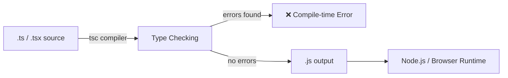
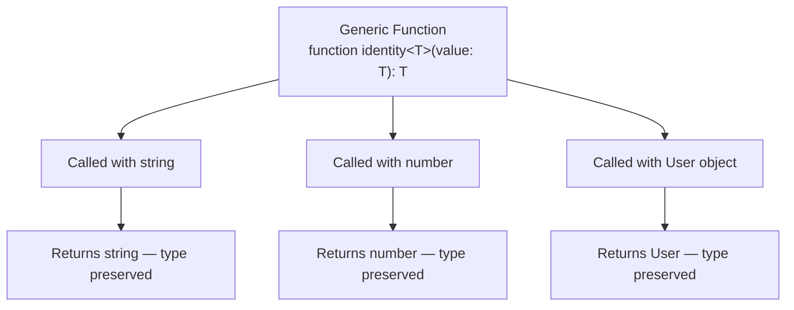

# Introduction to TypeScript — Guide

---

## 1. What is TypeScript?

- Open-source language by Microsoft, first released in 2012.
- A **strict syntactical superset of JavaScript** — every valid JS program is also valid TS.
- Adds a **static type system** on top of JavaScript.
- `.ts` files don't run directly — they're compiled ("transpiled") by the TypeScript Compiler (`tsc`) into plain `.js`.
- Built to solve pain points of large JS codebases: untyped variables, unpredictable runtime errors, weak tooling.



- Key benefit: type errors are caught **before** the code runs — not by a user in production.

---

## 2. Why TypeScript Over JavaScript?

| Feature | JavaScript | TypeScript |
|---|---|---|
| Typing | Dynamic | Static (checked at compile time) |
| Error Detection | Mostly at runtime | Mostly at compile time |
| Tooling | Basic autocomplete | Rich IntelliSense, refactoring, inline docs |
| Refactoring Safety | Risky at scale | Safe — compiler flags broken references |
| Learning Curve | Lower | Slightly higher, pays off at scale |
| Output | Runs natively | Compiles down to JS |

**The problem in JS:**
```javascript
function calculateTotal(price, quantity) {
  return price * quantity;
}
calculateTotal(10, "5"); // returns 50 due to coercion — silent bug risk
```

**The fix in TS:**
```typescript
function calculateTotal(price: number, quantity: number): number {
  return price * quantity;
}
calculateTotal(10, "5"); // ❌ compile-time error
```

- TypeScript doesn't just catch typos — it catches **contract violations** between functions, objects, and modules across a codebase.

---

## 3. Setting Up TypeScript

```bash
npm install typescript --save-dev   # install
npx tsc --init                      # generate config
npx tsc index.ts                    # compile a file
npx tsc --watch                     # recompile on save
```

**Key `tsconfig.json` options:**

| Option | Purpose |
|---|---|
| `target` | JS version to compile down to (e.g. `ES2020`) |
| `strict` | Enables all strict type-checking rules |
| `module` | Module system in output (`CommonJS`, `ESNext`, etc.) |
| `outDir` | Where compiled `.js` files go |
| `rootDir` | Where compiler looks for `.ts` source |
| `esModuleInterop` | Improves CommonJS ↔ ES module compatibility |

- Always enable `"strict": true` on new projects — retrofitting it later is painful.

---

## 4. The Type System

**Primitive & structural types:**
```typescript
let age: number = 30;
let username: string = "sarah_dev";
let isActive: boolean = true;
let scores: number[] = [95, 88, 76];
let coordinates: [number, number] = [12.9, 77.6]; // tuple — fixed length & order
```

**The special types:**

| Type | Meaning | Safe? |
|---|---|---|
| `any` | Opts out of type checking entirely | ⚠️ Avoid |
| `unknown` | Could be anything, must be narrowed before use | ✅ Safe alternative to `any` |
| `void` | Function returns nothing | ✅ Normal for signatures |
| `never` | Function never returns (throws / infinite loop) | ✅ Used for exhaustiveness checks |

```typescript
function processInput(input: unknown) {
  if (typeof input === "string") {
    console.log(input.toUpperCase()); // narrowed to string, safe
  }
}
```

**Inference vs explicit typing:**
```typescript
let count = 5;   // inferred as 'number'
count = "five";  // ❌ still enforced
```
- Use explicit typing at **function boundaries** (params, return types).
- Let inference handle local variables — over-annotating adds noise, not value.

---

## 5. Interfaces vs Type Aliases

```typescript
interface User {
  readonly id: number;   // can't be reassigned
  name: string;
  email?: string;        // optional
}

type Point = { x: number; y: number };
```

| Capability | `interface` | `type` |
|---|---|---|
| Extending | `extends`, supports declaration merging | Uses intersections (`&`) |
| Unions | ❌ Not directly | ✅ `type Status = "active" \| "inactive"` |
| Primitives/tuples | ❌ Object shapes only | ✅ Can alias any type |
| Best for | Public API contracts, class shapes | Unions, complex compositions |

```typescript
interface Base { id: number }
interface Admin extends Base { role: "admin" }

type Shape = { kind: "circle"; radius: number } | { kind: "square"; side: number };
```

- Rule of thumb: `interface` for extendable objects/classes, `type` for unions and complex compositions.

---

## 6. Functions — Advanced Typing

```typescript
// Optional & default parameters
function greet(name: string, greeting: string = "Hello"): string {
  return `${greeting}, ${name}!`;
}

// Rest parameters
function sum(...numbers: number[]): number {
  return numbers.reduce((total, n) => total + n, 0);
}

// Function overloading
function getValue(key: string): string;
function getValue(key: number): number;
function getValue(key: string | number): string | number {
  return typeof key === "string" ? `id-${key}` : key * 2;
}
```
- Overloading gives the **caller** a precise return type based on what they pass in, while one implementation handles the logic.

---

## 7. Classes & Object-Oriented TypeScript

```typescript
abstract class Employee {
  protected constructor(
    public readonly id: number,
    private baseSalary: number
  ) {}

  abstract calculateBonus(): number;

  getSalary(): number {
    return this.baseSalary + this.calculateBonus();
  }
}

class Manager extends Employee {
  constructor(id: number, baseSalary: number, private teamSize: number) {
    super(id, baseSalary);
  }
  calculateBonus(): number {
    return this.teamSize * 500;
  }
}
```

| Modifier | Accessible From |
|---|---|
| `public` (default) | Anywhere |
| `private` | Only within the declaring class |
| `protected` | The class and its subclasses |
| `readonly` | Set once, in constructor, never reassigned |

- Constructor shorthand (`public readonly id: number`) auto-declares and assigns the property — removes boilerplate.

---

## 8. Generics — Reusable, Type-Safe Code

- Let a function/interface/class work with *any* type while preserving type safety — no need for `any`.



```typescript
function identity<T>(value: T): T {
  return value;
}
identity<string>("hello");
identity<number>(42);

interface ApiResponse<T> {
  data: T;
  status: number;
  success: boolean;
}

// Generic constraint — T must have a 'length' property
function logLength<T extends { length: number }>(item: T): void {
  console.log(item.length);
}
```
- Backbone of type-safe API clients, reusable UI components, and testing utilities (Playwright's `Page`/`Locator` types rely on generics internally).

---

## 9. Union Types, Intersection Types & Narrowing

```typescript
type Status = "pending" | "success" | "error"; // union — one of several values

type Timestamped = { createdAt: Date };
type Named = { name: string };
type Entity = Timestamped & Named;               // intersection — combines shapes
```

**Discriminated unions:**
```typescript
type Shape =
  | { kind: "circle"; radius: number }
  | { kind: "rectangle"; width: number; height: number };

function area(shape: Shape): number {
  switch (shape.kind) {
    case "circle": return Math.PI * shape.radius ** 2;   // narrowed
    case "rectangle": return shape.width * shape.height; // narrowed
  }
}
```
- The `kind` field is a **discriminant** — TS uses it to narrow the union inside each `case`, giving full autocomplete per branch.

---

## 10. Utility Types

```typescript
interface Product {
  id: number;
  name: string;
  price: number;
  description: string;
}

type ProductPreview = Pick<Product, "id" | "name">;
type ProductUpdate  = Partial<Product>;
type ProductSummary = Omit<Product, "description">;
type ProductMap     = Record<number, Product>;
type ReadonlyProduct = Readonly<Product>;
```

| Utility | What it does |
|---|---|
| `Partial<T>` | Makes all properties optional |
| `Required<T>` | Makes all properties mandatory |
| `Readonly<T>` | Makes all properties immutable |
| `Pick<T, K>` | Selects a subset of properties |
| `Omit<T, K>` | Excludes a subset of properties |
| `Record<K, V>` | Builds object type with keys `K`, values `V` |
| `ReturnType<T>` | Extracts a function's return type |

---

## 11. Advanced Type Manipulation

**`keyof` and `typeof`:**
```typescript
interface User { id: number; name: string; }
type UserKeys = keyof User;   // "id" | "name"

const config = { retries: 3, timeout: 5000 };
type Config = typeof config;  // { retries: number; timeout: number }
```

**Mapped types:**
```typescript
type Optional<T> = { [K in keyof T]?: T[K] };
```

**Conditional types:**
```typescript
type IsString<T> = T extends string ? "yes" : "no";
type A = IsString<string>; // "yes"
type B = IsString<number>; // "no"
```
- Conditional and mapped types power most utility types from Section 10 — understanding them means you can build your own.

---

## 12. Modules

```typescript
// mathUtils.ts
export function add(a: number, b: number): number { return a + b; }
export const PI = 3.14159;

// app.ts
import { add, PI } from "./mathUtils";
```
- Each file with a top-level `import`/`export` is its own module scope.
- Prefer **named exports** for utilities; use **default exports** sparingly (one primary class/component per file).

---

## 13. TypeScript in Real Projects

| Environment | Why TypeScript Helps |
|---|---|
| Node.js / Express APIs | Typed request/response bodies, safer route refactors |
| React | Typed props/state catch UI bugs before render |
| Playwright | Typed `Page`, `Locator`, fixture objects — full autocomplete, catches broken Page Object references at compile time |

```typescript
import { Page, Locator } from "@playwright/test";

export class LoginPage {
  private readonly usernameInput: Locator;
  private readonly passwordInput: Locator;
  private readonly submitButton: Locator;

  constructor(private page: Page) {
    this.usernameInput = page.locator("#username");
    this.passwordInput = page.locator("#password");
    this.submitButton = page.locator("button[type=submit]");
  }

  async login(username: string, password: string): Promise<void> {
    await this.usernameInput.fill(username);
    await this.passwordInput.fill(password);
    await this.submitButton.click();
  }
}
```
- Every method signature declares exactly what it expects and returns — valuable when a test suite grows to hundreds of specs across contributors.

---

## 14. Best Practices

- Enable `strict` mode from day one.
- Avoid `any` — prefer `unknown` and narrow it, or define a proper type.
- Type function boundaries explicitly, let inference handle local variables.
- Prefer discriminated unions over scattered optional flags.
- Use utility types (`Partial`, `Pick`, `Omit`) instead of duplicating interfaces.
- Keep types close to their domain — colocate with implementation rather than one giant `types.ts`.
- Treat every `tsc` error as a real bug, not a formality to silence.

---

## Q&A

**Q1. What is TypeScript, and how does it relate to JavaScript?**

A:
- TypeScript is a strict syntactical superset of JavaScript.
- Every valid JS program is valid TS.
- It adds a static type system on top.
- `.ts` files are compiled to plain `.js` before running.

**Q2. Why would a team choose TypeScript over plain JavaScript?**

A:
- Type errors are caught at compile time instead of runtime.
- Better tooling — autocomplete, inline docs, safe refactoring.
- Prevents silent bugs from type coercion (e.g. passing a string where a number is expected).

**Q3. What does the `strict` flag in `tsconfig.json` do?**

A:
- Enables all strict type-checking options at once.
- Forces disciplined typing habits.
- Recommended to enable from the start of a project.

**Q4. What is the difference between `any` and `unknown`?**

A:
- `any` completely opts out of type checking — unsafe.
- `unknown` also accepts any value, but it must be narrowed (e.g. with `typeof`) before use.
- `unknown` is the safer choice in almost all cases.

**Q5. What is the difference between `interface` and `type` in TypeScript?**

A:
- `interface` supports `extends` and declaration merging; best for object/class shapes that may be extended.
- `type` supports unions, intersections, and can alias any type (not just objects).
- Use `interface` for public API contracts, `type` for unions and complex compositions.

**Q6. What is type inference, and when should you rely on it vs explicit typing?**

A:
- Type inference means TypeScript automatically determines a variable's type from its assigned value.
- Rely on inference for local variables.
- Use explicit typing at function boundaries — parameters and return types.

**Q7. Explain function overloading in TypeScript with a use case.**

A:
- Overloading lets one function name have multiple call signatures.
- Each signature declares a different parameter/return type combination.
- The caller gets a precise return type based on what they passed in.
- One implementation signature internally handles all cases using type checks.

**Q8. What are access modifiers in TypeScript classes, and how do they differ?**

A:
- `public` (default) — accessible from anywhere.
- `private` — accessible only within the declaring class.
- `protected` — accessible within the class and its subclasses.
- `readonly` — can be set once (usually in the constructor), never reassigned after.

**Q9. What are generics, and why are they preferred over using `any`?**

A:
- Generics let a function/class/interface work with any type while preserving that type's identity.
- Unlike `any`, the specific type is tracked and enforced — you still get autocomplete and type errors.
- Commonly used in API clients, reusable components, and typed utilities.

**Q10. What is a discriminated union, and why is it useful?**

A:
- A union of object types that share a common literal field (the "discriminant"), like `kind`.
- TypeScript uses that field to narrow which shape you're working with inside conditional branches.
- Gives full autocomplete and type safety per branch, avoiding scattered optional properties.

**Q11. Name three TypeScript utility types and explain what each does.**

A:
- `Partial<T>` — makes all properties of `T` optional.
- `Pick<T, K>` — creates a new type with only the selected keys `K` from `T`.
- `Omit<T, K>` — creates a new type excluding the selected keys `K` from `T`.
- (Others: `Required<T>`, `Readonly<T>`, `Record<K, V>`, `ReturnType<T>`.)

**Q12. What do `keyof` and `typeof` do in TypeScript's type system?**

A:
- `keyof T` produces a union of all property names (keys) of type `T`.
- `typeof value` extracts the type of a variable or object, usable in type positions.
- Both are commonly combined with mapped and conditional types to build reusable type utilities.

**Q13. What is a mapped type? Give a conceptual example.**

A:
- A mapped type loops over the keys of an existing type to produce a new type.
- Example concept: a type that takes any object type `T` and makes every property optional, by iterating `[K in keyof T]` and appending `?`.
- Powers many built-in utility types like `Partial` and `Readonly`.

**Q14. How do conditional types work, and where are they used?**

A:
- A conditional type evaluates like a ternary at the type level: `T extends U ? X : Y`.
- Used to build types that change shape based on an input type.
- They underpin many of TypeScript's built-in utility types.

**Q15. In a large-scale project (e.g. a test automation framework with Playwright), what concrete benefits does TypeScript provide over plain JavaScript?**

A:
- Typed `Page`, `Locator`, and fixture objects give autocomplete for selectors and actions.
- Broken Page Object Model references are caught at compile time, not discovered mid test-run.
- Method signatures declare exact expected inputs/outputs, which scales well when a suite grows to hundreds of specs across multiple contributors.
- Refactoring across the codebase is safer since the compiler flags every broken reference.
