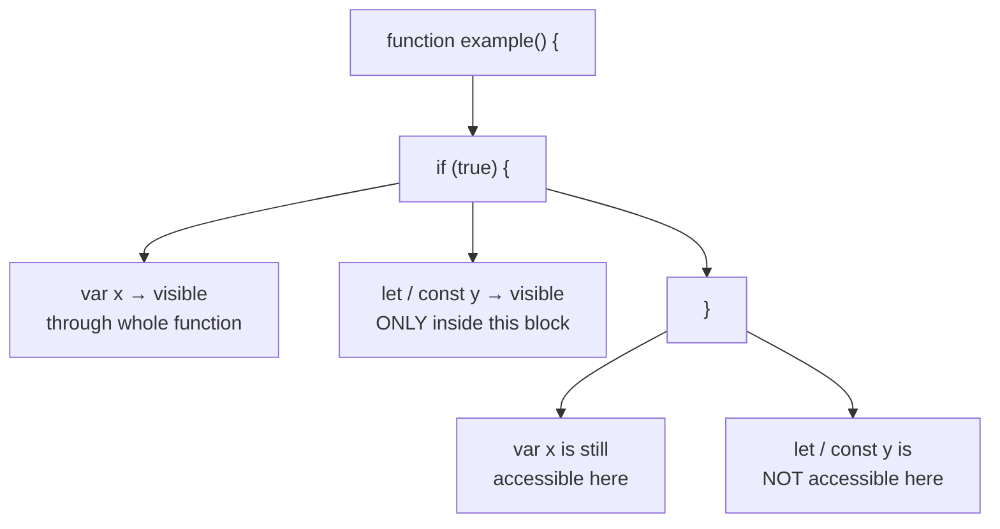
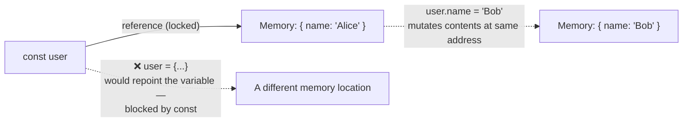
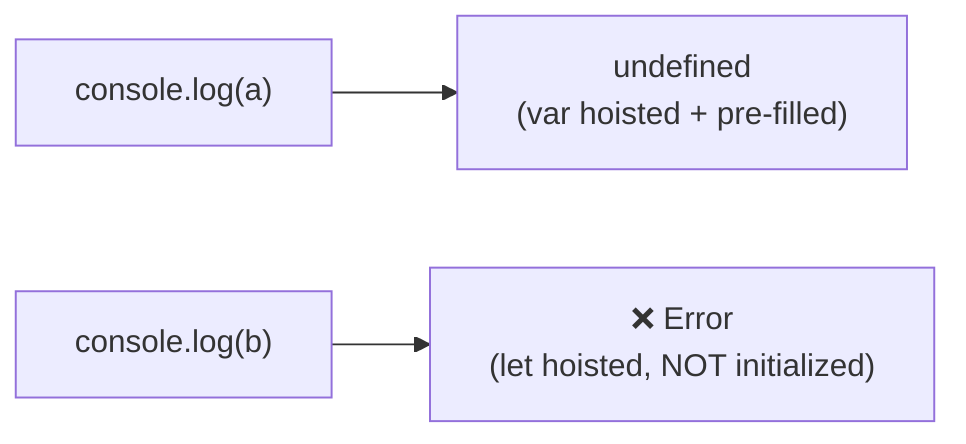
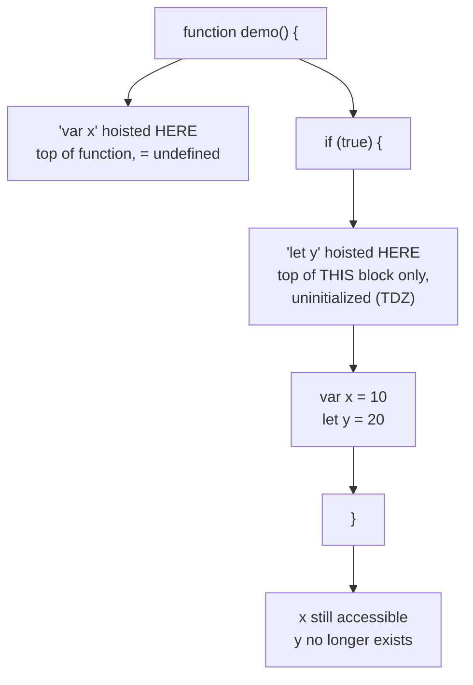

# TypeScript Variables — Guide

---

## 1. Comments

- Used to add notes in code that the compiler ignores — purely for humans reading the code.

**Single-line comment:**
```typescript
// This is a single-line comment
```
- Shortcut: `Ctrl + /` (Windows/Linux), `Cmd + /` (Mac)

**Multi-line (block) comment:**
```typescript
/*
 This is a multi-line comment
 Spanning multiple lines
*/
```
- Shortcut: `Shift + Alt + A` (Windows/Linux), `Shift + Option + A` (Mac)

---

## 2. Variables

- A **container** that can hold data — a named reference to a value in memory.
- TypeScript (and JavaScript) offers three ways to declare a variable: `var`, `let`, and `const`.
- Each behaves differently across five dimensions: **scope, value assignment, re-declaration, re-assignment, and hoisting** (each covered below).

```typescript
let username: string = "sarah";
const maxUsers: number = 100;
var legacyFlag = true; // works, but avoid in modern code
```

---

## 3. Variables — Scope

**Scope** means *where in the code a variable is accessible from*.

### `var` → Function Scope
- Accessible **anywhere inside the function** it's declared in — not limited to `{}` blocks like `if` or `for`.
- Can lead to unexpected behavior since it "leaks" out of blocks.

```typescript
function exampleVar() {
  if (true) {
    var message = "Hello, World!";
  }
  console.log(message); // Works! — var is function-scoped, not block-scoped
}
```

### `let` & `const` → Block Scope
- Only accessible **inside the `{}` block** where declared — safer and more predictable.

```typescript
function exampleLetConst() {
  if (true) {
    let message = "Hello, let!";
    const greeting = "Hello, const!";
  }
  // console.log(message);  // ❌ Error: not accessible outside the block
  // console.log(greeting); // ❌ Error: not accessible outside the block
}
```



---

## 4. Variables — Declaration (Value Assignment)

- `var` and `let` — assigning a value at declaration is **optional**.
- `const` — assigning a value at declaration is **mandatory**.

```typescript
var b;
console.log(b); // undefined

let d;
console.log(d); // undefined

const f;        // ❌ Error: Missing initializer in 'const' declaration
const g = 60;    // ✅ Works — value assigned immediately
```

---

## 5. Variables — Re-declaration

**Re-declaration** means declaring a variable with the **same name again** using the same keyword, in the same scope.

| Keyword | Allows Re-declaration? |
|---|---|
| `var` | ✅ Yes |
| `let` | ❌ No |
| `const` | ❌ No |

```typescript
var city = "New York";
var city = "Los Angeles"; // ✅ Allowed — but risky, can cause bugs silently

let country = "USA";
// let country = "Canada"; // ❌ Error — safer, prevents accidental overwrites

const planet = "Earth";
// const planet = "Mars"; // ❌ Error
```

---

## 6. `var` — Re-assignment / Re-initialization

**Re-assignment** means changing the value of a variable that **already exists** — without repeating the declaration keyword.

| Keyword | Allows Re-assignment? |
|---|---|
| `var` | ✅ Yes |
| `let` | ✅ Yes |
| `const` | ❌ No |

```typescript
var age = 25;
age = 30; // ✅ Allowed

let score = 50;
score = 60; // ✅ Allowed

const pi = 3.14;
// pi = 3.14159; // ❌ Error — cannot change a constant's value
```

- Note the distinction: `const` blocks **re-assignment** of the variable itself, but if a `const` holds an **object or array**, its internal properties can still be modified — only the variable's reference is locked, not the data inside it.

```typescript
const user = { name: "Alice" };
user.name = "Bob"; // ✅ Allowed — modifying a property, not reassigning 'user' itself
// user = { name: "Charlie" }; // ❌ Error — this reassigns the variable itself
```

### Why this happens — Reference vs Value

- For **primitives** (`string`, `number`, `boolean`), a variable directly stores the value itself.
- For **objects/arrays**, a variable stores a **reference** — essentially an address pointing to where the object actually lives in memory (informally, "the heap").
- `const` locks only the **binding** — meaning it locks *what the variable points to*. It has no control over what exists *at* that memory location.



- `user.name = "Bob"` reaches **through** the reference and changes data at that address — the variable itself never moves.
- `user = { name: "Charlie" }` tries to make `user` point to a **new** address — that's a change to the binding, which `const` blocks.

**Key distinction (important at senior level):** `const` gives **reference immutability**, not **value immutability**. For genuinely immutable data:
- `Object.freeze(obj)` — prevents adding/removing/reassigning top-level properties, but it's **shallow**: a nested object inside remains fully mutable unless frozen recursively.
- TypeScript's `readonly` on interface/type properties — a **compile-time only** guarantee; it doesn't exist at runtime and can be bypassed with a type assertion.
- `readonly T[]` / `ReadonlyArray<T>` — blocks mutating array methods, also compile-time only.
- True deep immutability usually needs a recursive freeze utility or a library like Immer.

---

## 7. Hoisting — `var` vs `let`/`const`

- **Hoisting** means the JavaScript/TypeScript engine registers variable declarations in their scope *before* running the code, during a "scan" phase.
- `var` — hoisted **and initialized as `undefined`** automatically.
- `let` & `const` — hoisted, but **not initialized** — accessing them before their declaration line throws an error (this gap is called the **"temporal dead zone" (TDZ)** — the period where the variable exists but can't be used yet).

```typescript
console.log(a); // undefined — var is hoisted and pre-initialized
var a = 10;

console.log(b); // ❌ Error — cannot access before initialization
let b = 20;

console.log(c); // ❌ Error — cannot access before initialization
const c = 30;
```



### Where exactly are they hoisted *to*?

This is the part that's easy to gloss over — the hoisting **destination** itself is different, not just the initialization behavior.

- `var` hoists to the top of the nearest **function scope** (or the global scope, if declared outside any function) — it ignores block boundaries like `if {}` or `for {}` entirely.
- `let` / `const` hoist only to the top of the nearest **block scope** `{ }` they're declared in — never past it, and never up to the function level.

```typescript
function demo() {
  console.log(x); // undefined — var is hoisted to the top of the FUNCTION
  if (true) {
    console.log(y); // ❌ ReferenceError — let is hoisted only to the top of THIS block
    var x = 10;
    let y = 20;
  }
  console.log(x); // 10 — still accessible, var leaked out of the block
  // console.log(y); // ❌ ReferenceError — y doesn't exist here, block already ended
}
```



- Both go through the same **scan-then-run** process — the engine registers identifiers first, then executes code top to bottom.
- The real difference: `var`'s registered slot is immediately filled with `undefined`, so it's always "safe" to read early (just unhelpful). `let`/`const`'s registered slot stays **locked** (the TDZ) from the top of their block until the actual declaration line runs — reading it early is a hard error, not a silent `undefined`.

---

## Summary Table

| Feature | `var` | `let` | `const` |
|---|---|---|---|
| Scope | Function | Block | Block |
| Value assignment at declaration | Not mandatory | Not mandatory | Mandatory |
| Re-declare | Allowed | Not allowed | Not allowed |
| Re-assign / Reinitialize | Allowed | Allowed | Not allowed |
| Hoisting | Hoisted, `undefined` | Hoisted, not initialized | Hoisted, not initialized |
| Best use | Avoid | Values that change | Constants |

---

## Best Practices

- **Avoid `var`** — its function scope can cause unexpected bugs, especially inside loops and conditionals.
- **Use `let`** — when a variable's value needs to change later.
- **Use `const`** — for values that should never be reassigned; make it the default choice unless reassignment is truly needed.

---

## Q&A

**Q1. What is a variable?**

A:
- A container that holds data.
- It's a named reference to a value stored in memory.
- In TypeScript, it can be declared using `var`, `let`, or `const`.

**Q2. What is the difference between `var` and `let` in terms of scope?**

A:
- `var` is function-scoped — accessible anywhere inside the enclosing function, even outside `if`/`for` blocks.
- `let` is block-scoped — accessible only within the `{}` block where it's declared.
- This makes `let` safer and more predictable in nested code.

**Q3. Is assigning a value mandatory when declaring a variable?**

A:
- For `var` and `let`, assigning a value is optional — the variable defaults to `undefined`.
- For `const`, assigning a value is mandatory — omitting it causes a compile-time error.

**Q4. Can you re-declare a variable using the same name and keyword in the same scope?**

A:
- `var` allows re-declaration in the same scope.
- `let` and `const` do not allow re-declaration — doing so throws an error.
- This is one reason `let`/`const` are considered safer than `var`.

**Q5. What is the difference between re-declaration and re-assignment?**

A:
- Re-declaration means declaring the variable again using the keyword (`let x` a second time).
- Re-assignment means changing the value of an already-declared variable, without repeating the keyword (`x = newValue`).
- `var` allows both; `let` allows only re-assignment; `const` allows neither.

**Q6. Can you reassign a `const` variable?**

A:
- No — `const` does not allow reassigning the variable's binding.
- If the `const` holds an object or array, its internal properties can still be modified — because that only changes data at the referenced memory location, not the binding itself (explained in more depth in Q12).

**Q7. What is hoisting, and how does it affect `var`?**

A:
- Hoisting means variable declarations are moved to the top of their scope before the code runs.
- `var` is hoisted and automatically initialized as `undefined`, so accessing it before its declaration line doesn't throw an error — it just logs `undefined`.

**Q8. How does hoisting behave differently for `let` and `const` compared to `var`?**

A:
- `let` and `const` are also hoisted, but they are **not** initialized.
- Accessing them before their declaration line throws an error, rather than returning `undefined`.
- This gap between hoisting and initialization is known as the "temporal dead zone" (TDZ).

**Q9. Are `let` and `const` hoisted to the same place as `var`? If not, where exactly?**

A:
- No — the hoisting *destination* itself is different, not just the initialization behavior.
- `var` is hoisted to the top of the nearest **function scope** (or global scope, if outside any function) — it ignores block boundaries entirely.
- `let` and `const` are hoisted only to the top of the nearest **block scope** `{ }` they're declared in.
- Example: a `let` declared inside an `if` block only exists (and stays in TDZ) from the top of that `if` block — not from the top of the enclosing function, the way `var` would.

**Q10. Why is `var` generally discouraged in modern TypeScript/JavaScript code?**

A:
- Its function scope allows it to "leak" out of blocks like `if` and `for`, leading to unexpected bugs.
- It allows re-declaration in the same scope, which can silently overwrite values by accident.
- `let` and `const` provide safer, more predictable scoping and stricter rules.

**Q11. Give a practical example of a bug that `var`'s function scope could cause inside a loop, that `let` would prevent.**

A:
- With `var` inside a loop used in an asynchronous callback (like `setTimeout`), all callbacks share the same single `var` variable, so they all see its final value after the loop finishes.
- With `let`, each loop iteration gets its own separate binding of the variable, so each callback correctly captures the value at that specific iteration.
- This is a classic interview question testing understanding of scope combined with closures (a function "remembering" variables from where it was defined).

**Q12. Why does TypeScript allow modifying properties of a `const` object but not reassigning the object itself?**

A:
- `const` only locks the **binding** — meaning the variable can't be repointed to a different reference.
- For objects/arrays, the variable stores a reference (an address) to where the object lives in memory, not the object's data directly.
- Modifying a property reaches through that reference and changes data at the same address — the binding itself never moves, so `const`'s rule isn't violated.
- Reassignment (`user = {...}`) would try to point the variable to a new address, which is exactly what `const` blocks.
- To make the object's contents immutable too, additional techniques like `Object.freeze()` (shallow) or TypeScript's `readonly` (compile-time only) are needed.

**Q13. In a code review, when would you flag the use of `var` as a problem, even if the code currently works?**

A:
- If it's used inside a block (`if`, `for`, `while`) where block-scoping was clearly intended — since it can leak beyond that block unexpectedly.
- If it's used inside a loop combined with asynchronous code — since all iterations would share the same variable, likely causing logic bugs.
- Even if the code works today, `var`'s looser rules make future refactors riskier, so flagging it early enforces safer long-term habits.
