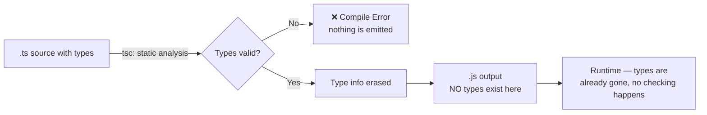
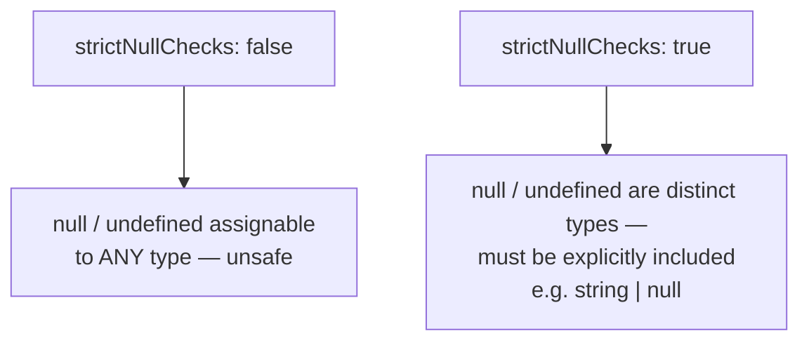
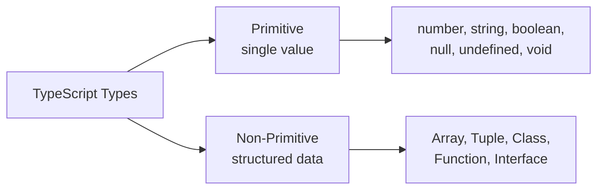

# TypeScript Data Types — Guide

---

## 1. Dynamically Typed vs Statically Typed Languages

### JavaScript — Dynamically Typed
- Variable types are checked at **runtime**, and a variable's type can change freely during execution.

```javascript
let age = 25;          // age is a number
age = "twenty-five";   // now a string — no error
console.log(age);      // "twenty-five"
```

### TypeScript — Statically Typed
- Variable types are checked at **compile time**, and once a type is set, it can't silently change to something incompatible.

```typescript
let data: number = 10;
data = "ten"; // ❌ Error: Type 'string' is not assignable to type 'number'
```

### What "compile time" actually means here
- TypeScript's compiler (`tsc`) performs **static analysis** — it walks through the code and checks every assignment, function call, and expression against the declared types *before* generating any JavaScript.
- Once compilation succeeds, all type information is **stripped out** — the emitted `.js` file has no types in it at all. This is called **type erasure**.
- This matters because: type checking is a **development-time safety net**, not a runtime guarantee. If invalid data enters the program from outside TypeScript's view — an API response, `JSON.parse()`, user input — TypeScript won't catch it, because that data was never statically analyzed. Runtime validation (e.g. schema checking) is still needed for those cases.



---

## 2. Type-Safety

### JavaScript — Not Type-Safe
- Allows operations between incompatible types, silently converting one to fit the other (**implicit type coercion**).

```javascript
const result = "5" + 3; // 3 is coerced to "3", then concatenated
console.log(result);    // "53" — not 8, and no error at all
```

### TypeScript — Type-Safe
- Blocks operations between incompatible types before the code ever runs.

```typescript
const result: number = "5" + 3; // ❌ Error: Type 'string' is not assignable to type 'number'
```

- The underlying issue in JS is that `+` is **overloaded** — it means numeric addition *or* string concatenation, decided at runtime based on the operand types. TypeScript forces you to be explicit about which one you meant, by enforcing the declared type of the result.
- Type-safety doesn't mean "no bugs" — it means an entire *category* of bugs (wrong-type operations) gets caught before deployment instead of surfacing as a production incident.

---

## 3. TypeScript Types, Annotations & Type Inference

### Types
- Built-in or custom categories that describe what kind of value a variable can hold.

```typescript
let isDone: boolean = true;
let score: number = 100;
```

### Type Annotations
- Explicitly telling TypeScript a variable's type using `: type`.

```typescript
let name: string = "Alice";
let age: number = 30;
```

### Type Inference
- TypeScript automatically determines a variable's type from its initial value, when no annotation is given.

```typescript
let message = "Hello"; // inferred as string
let count = 42;        // inferred as number
// message = 123;      // ❌ Error — inference still locks the type in
```

- Inference isn't just "look at the value" — TypeScript also uses **contextual typing**, where the *expected* type from the surrounding code influences what a value is inferred as. For example, a function parameter's type can be inferred from how a variable is later used, or from a callback's expected signature (like in `array.map(...)`, where the callback's parameter types are inferred from the array's element type).
- For arrays and object literals with mixed values, TypeScript infers the **best common type** — the narrowest type that fits every element, falling back to a union if no single type works.

```typescript
let mixed = [1, "two", 3]; // inferred as (string | number)[]
```

**When to use which:**
- Use explicit annotations at **function boundaries** — parameters and return types — since inference can't know what a function *should* accept or return, only what it currently does.
- Let inference handle local variables — annotating `let age: number = 30` adds no extra safety over `let age = 30`, just visual noise.

---

## 4. Primitive Data Types

### Number
- Represents **both integers and decimals** — TypeScript (like JavaScript) has only one numeric type, unlike languages with separate `int`, `float`, `double`.
- Internally, all numbers use the **IEEE 754 double-precision floating-point** format — this is why certain decimal calculations (e.g. `0.1 + 0.2`) don't produce an exact result.
- Special numeric values exist: `NaN` ("Not a Number", returned by invalid math operations) and `Infinity`. Notably, `NaN` is the only value in the language that is **not equal to itself** (`NaN === NaN` is `false`) — checking for it requires `Number.isNaN()`, not equality.

```typescript
let price: number = 42;
let pi: number = 3.14;
```

### String
- Represents text data. Can be written with single quotes, double quotes, or backticks.
- Backticks enable **template literals**, allowing embedded expressions via `${...}`.

```typescript
let city: string = "Delhi";
let greeting: string = `Hello, ${city}!`;
```

- Beyond plain `string`, TypeScript supports **string literal types** — a type that only allows one specific string value (or a fixed set of them), not any string at all. This is the foundation of discriminated unions and strict API contracts.

```typescript
let direction: "up" | "down"; // only these two exact strings are valid
```

### Boolean
- Represents `true` or `false`, used in conditions.

```typescript
let isLoggedIn: boolean = true;
if (isLoggedIn) { /* ... */ }
```

- The primitive `boolean` type should not be confused with the `Boolean` object wrapper (capital B) — using `Boolean` as a type annotation is almost always a mistake and disables some of TypeScript's stricter checks around truthy/falsy values.

### Null
- Represents an **intentional empty value** — a variable that deliberately holds "nothing."

```typescript
let x: null = null;
```

- Its behavior depends heavily on the `strictNullChecks` compiler flag — think of this setting as deciding: **"Is a variable allowed to secretly be empty?"**

  **When it's OFF:**
  - Any variable — even one you said is a `string` — is secretly allowed to hold `null` too, and TypeScript won't warn you.
  - So you might write code assuming a variable always holds text, call `.toUpperCase()` on it, and the program crashes — because it turned out to be `null` all along, and nothing ever warned you it could be.

  **When it's ON (the recommended setting, part of `strict: true`):**
  - If you say a variable is a `string`, it must **actually always be a string** — `null` is no longer allowed to sneak in.
  - If you genuinely want that variable to sometimes be empty, you have to **say so out loud** in the type: `string | null` (meaning "this is a string, OR it might be null").
  - This way, everywhere that variable is used, TypeScript forces you to check "could this be null right now?" before you use it — so you catch the problem while writing the code, not when the app crashes for a user.

### Undefined
- Represents a variable that has been **declared but not yet assigned** a value.

```typescript
let y: undefined;
console.log(y); // undefined
```

- Same `strictNullChecks` behavior applies here as with `null` — under strict mode, a type must explicitly include `| undefined` to allow it.
- Both `null` and `undefined` basically mean "there's nothing here" — but they hint at *why*:
  - **`undefined`** = "nobody has put anything here yet." It's what a variable is automatically, before you ever give it a value — JavaScript sets this on its own.
  - **`null`** = "someone deliberately emptied this out." You write `null` yourself, on purpose, to say "this is intentionally blank."
  - Simple analogy: think of a form field. `undefined` is a field the user hasn't gotten to yet. `null` is a field the user looked at and deliberately left blank.
  - This meaning isn't actually enforced by the language — nothing stops you from using them the "wrong" way around. It's just a convention most developers follow to keep code easier to read.



### Any
- A flexible type that allows **any value** and disables type checking entirely for that variable.

```typescript
let z: any = "Hello";
z = 10; // ✅ Allowed — no checking happens at all
```

- `any` is **contagious** — once a value of type `any` flows into other variables or function calls, it silently disables type checking for everything downstream that touches it too, even in code that was otherwise fully typed. This is why a single `any` can quietly undermine safety across a much larger portion of a codebase than it appears to at first glance.
- The safer alternative in most cases is `unknown` — it also accepts any value, but unlike `any`, it **forces you to narrow the type** (e.g. with `typeof` or a type guard) before you're allowed to use it in most operations. `any` skips this check entirely; `unknown` demands it.

```typescript
function handle(input: unknown) {
  if (typeof input === "string") {
    console.log(input.toUpperCase()); // only allowed after narrowing
  }
}
```

### Union Type
- Allows a variable to hold **one of several specified types**.

```typescript
let id: string | number = "123";
id = 456; // also valid
```

- A union type doesn't give you access to every member of every type in the union — only to members that exist on **all** types in the union, until you **narrow** it (using `typeof`, `instanceof`, or a custom type guard) to a specific branch.

```typescript
function printId(id: string | number) {
  // id.toUpperCase(); // ❌ Error — number doesn't have this method
  if (typeof id === "string") {
    console.log(id.toUpperCase()); // ✅ narrowed to string here
  }
}
```

### Void
- Used for functions that **don't return a usable value**.

```typescript
function log(): void {
  console.log("Hi");
}
```

- `void` and `undefined` are related but not identical for function return types. A function typed `void` is allowed to return `undefined` implicitly (no `return` statement), but there's a specific quirk: when typing a **callback parameter** as returning `void`, TypeScript will still accept a function that returns *something else* — the return value is simply ignored. This is intentional, so that functions like `array.forEach()` can accept callbacks that happen to return a value (like an arrow function's implicit return) without a type error.

```typescript
let callback: () => void;
callback = () => { return 42; }; // ✅ Allowed — the '42' is just ignored
```

---

## 5. Non-Primitive Types (Overview)

These hold **structured, composite data** rather than a single value — each has enough depth to deserve its own dedicated guide, so only listed briefly here:

- **Array** — an ordered, indexable collection of same-typed values.
- **Tuple** — a fixed-length array with a specific type per position.
- **Class** — a blueprint for creating objects with defined properties and methods.
- **Function** — itself a typed value, with a specific parameter and return type signature.
- **Interface** — a contract describing the shape an object must conform to.



---

## Q&A

**Q1. What is the core difference between a dynamically typed and a statically typed language?**

A:
- In a dynamically typed language (JavaScript), types are checked at runtime, and a variable's type can change freely.
- In a statically typed language (TypeScript), types are checked at compile time, before the code ever runs.
- This shifts an entire category of bugs from "discovered in production" to "caught during development."

**Q2. Does TypeScript's type checking exist at runtime? Explain what actually happens to types after compilation.**

A:
- No — TypeScript's type system exists only at compile time.
- During compilation, `tsc` performs static analysis, and once it's satisfied, all type annotations are stripped out — this is called type erasure.
- The emitted JavaScript file contains no type information at all, meaning nothing is checking types while the program actually runs.

**Q3. If TypeScript's types are erased at runtime, how would you actually validate data coming from an external source like an API response?**

A:
- TypeScript cannot validate data it never statically analyzed — an API response is just treated as whatever type you tell it to be, correct or not.
- Runtime validation is needed separately, using something like a schema validation library, manual `typeof`/property checks, or type guard functions.
- Declaring a type for API data is a promise to the compiler, not an enforced guarantee — trusting it blindly is a common source of production bugs.

**Q4. What is implicit type coercion, and how does TypeScript prevent the bugs it can cause?**

A:
- Implicit type coercion is when a language automatically converts one type to another to make an operation "work," like JavaScript converting a number to a string during `+`.
- TypeScript prevents this by enforcing that operations match the declared types of their operands, flagging mismatches at compile time instead of silently coercing them.

**Q5. What is the difference between type annotation and type inference?**

A:
- Type annotation is when you explicitly declare a variable's type using `: type`.
- Type inference is when TypeScript automatically determines the type from the assigned value, without an explicit annotation.
- Best practice: annotate function boundaries explicitly, and let inference handle local variables.

**Q6. What is contextual typing, and how does it differ from basic type inference?**

A:
- Basic type inference looks at the value being assigned to determine a variable's type.
- Contextual typing goes further — it uses the *expected* type from the surrounding code (like a callback's expected signature) to infer types for things like function parameters, even without an explicit annotation.
- Example: in `array.map((item) => ...)`, the type of `item` is inferred from the array's element type, not from anything written in the callback itself.

**Q7. Why does TypeScript only have one `number` type instead of separate types for integers and floats?**

A:
- All numbers in JavaScript (and by extension TypeScript) are stored using the IEEE 754 double-precision floating-point format.
- Since there's no separate underlying representation for integers vs decimals at the language level, TypeScript mirrors that with a single `number` type.
- This is also why certain decimal arithmetic (like `0.1 + 0.2`) doesn't produce an exact result — it's a floating-point precision limitation, not a TypeScript issue.

**Q8. Why is `NaN === NaN` false, and how should you correctly check for `NaN`?**

A:
- `NaN` is defined by the IEEE 754 standard to not be equal to any value, including itself.
- Using `===` to check for `NaN` will always return `false`, even when comparing a `NaN` value to itself.
- The correct way to check is `Number.isNaN(value)`, which specifically tests for this case.

**Q9. What is a string literal type, and what pattern does it enable?**

A:
- A string literal type restricts a variable to one specific string value, or a fixed set of them, instead of any string.
- Example: `let direction: "up" | "down";` only allows those two exact values.
- This pattern underlies discriminated unions, where a literal type field (like `kind: "circle"`) lets TypeScript narrow which shape of data you're working with in conditional branches.

**Q10. What does the `strictNullChecks` flag control, and why does it matter?**

A:
- Without it, `null` and `undefined` are assignable to any type, meaning a `string` variable could silently hold `null` without any compile-time warning.
- With it enabled, `null` and `undefined` become distinct types that must be explicitly included in a type (e.g. `string | null`) to be allowed.
- It's one of the most impactful strict-mode flags, since unchecked `null`/`undefined` access is one of the most common runtime error sources in JavaScript.

**Q11. What is the practical difference between `null` and `undefined`?**

A:
- `undefined` typically means a variable exists but hasn't been assigned a value yet — it's the language's own default.
- `null` typically means a value was deliberately set to "empty" or "nothing" by the developer.
- This distinction is a convention, not something enforced by the language — both behave similarly under `strictNullChecks`.

**Q12. Why is `any` considered risky, and how is it different from `unknown`?**

A:
- `any` completely disables type checking for that variable, and that loss of safety spreads to anything downstream that uses it — a single `any` can silently undermine type safety in a much larger portion of the codebase than it first appears.
- `unknown` also accepts any value, but forces you to narrow the type (e.g. with `typeof`) before performing most operations on it.
- `unknown` is the safer default whenever a value's type genuinely isn't known upfront, such as data from an external source.

**Q13. Given a variable of a union type like `string | number`, why can't you immediately call a string-only method on it?**

A:
- TypeScript only allows access to members that exist on every type in the union — a `number` doesn't have `.toUpperCase()`, so calling it isn't safe without knowing which type you actually have.
- You need to narrow the type first — using `typeof`, `instanceof`, or a custom type guard — before the compiler allows access to type-specific members.

**Q14. Explain the quirk where a callback typed to return `void` can still accept a function that returns a value.**

A:
- When a callback parameter is typed as `() => void`, TypeScript still allows passing a function that actually returns something — the returned value is simply ignored.
- This exists intentionally so that patterns like `array.forEach((item) => update(item))` work, even if `update()` happens to return a value (such as through an arrow function's implicit return) — without triggering a type error.
- This behavior is specific to function type positions; it doesn't mean `void` and "any return type" are the same thing everywhere.

**Q15. Would TypeScript catch a bug where invalid data from `JSON.parse()` is used as if it matched a declared interface? Why or why not?**

A:
- No — `JSON.parse()` returns type `any` by default, so TypeScript has no static information to check against a declared interface.
- If you assign the parsed result to a variable typed with an interface, TypeScript trusts that annotation without verifying it against the actual runtime data.
- This is a common real-world gap between compile-time types and runtime reality, which is why runtime validation is still necessary for external data sources.
