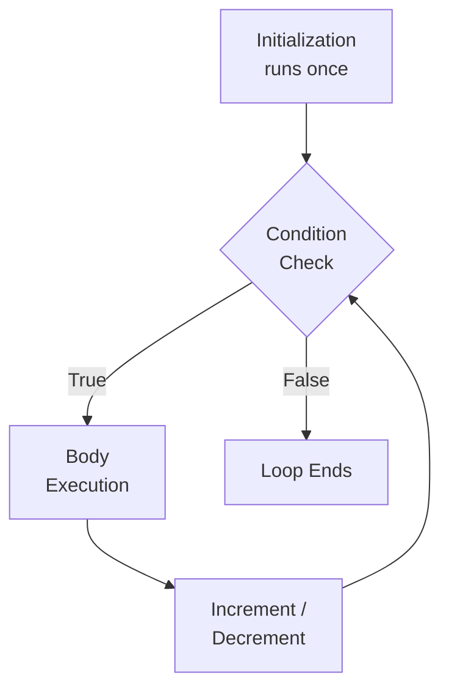
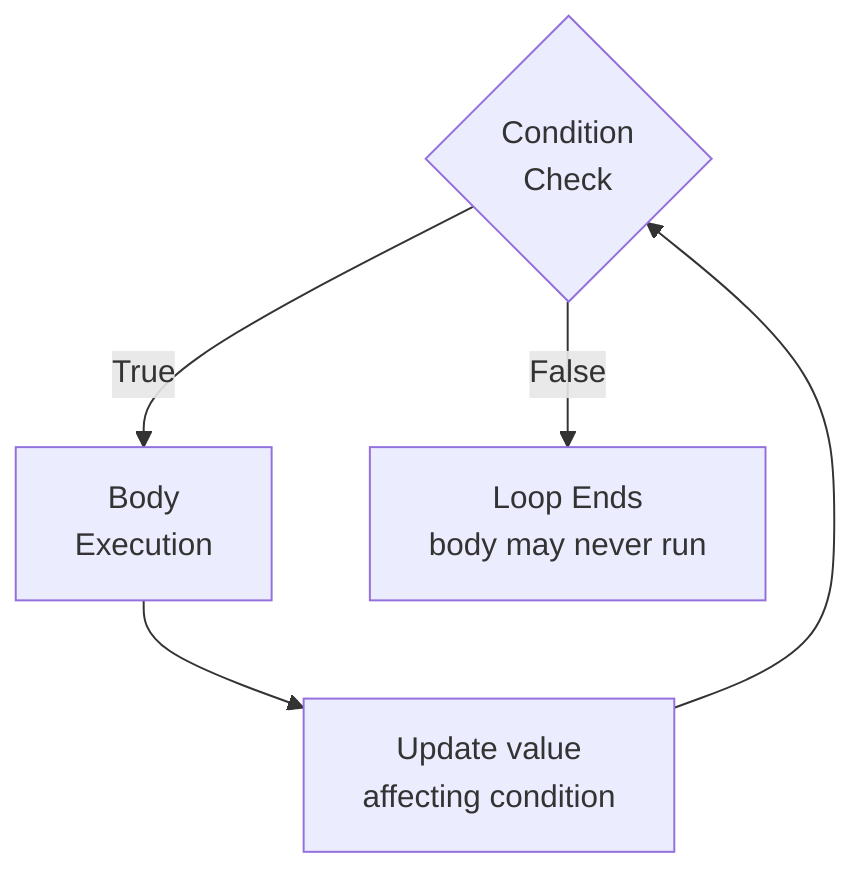
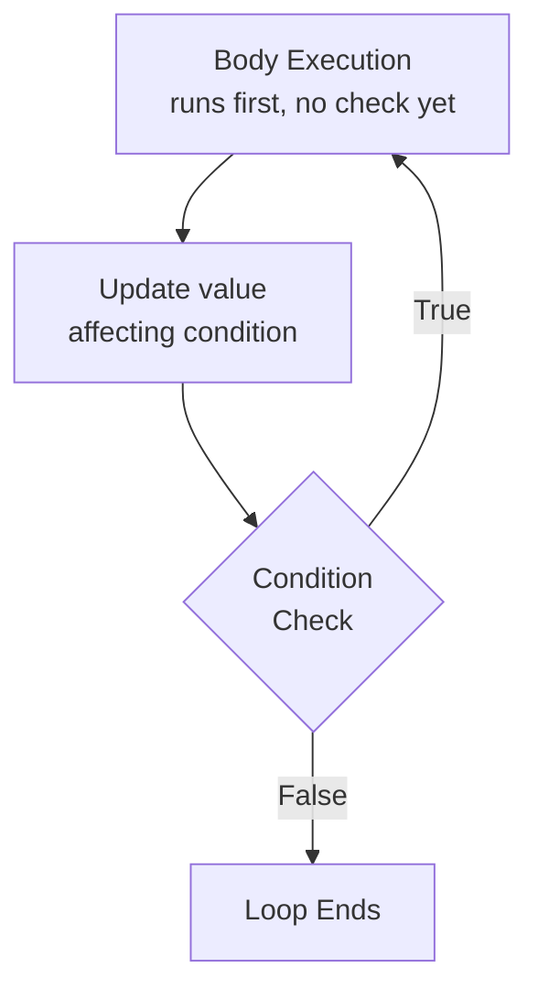
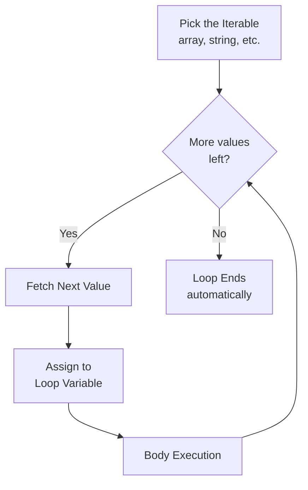
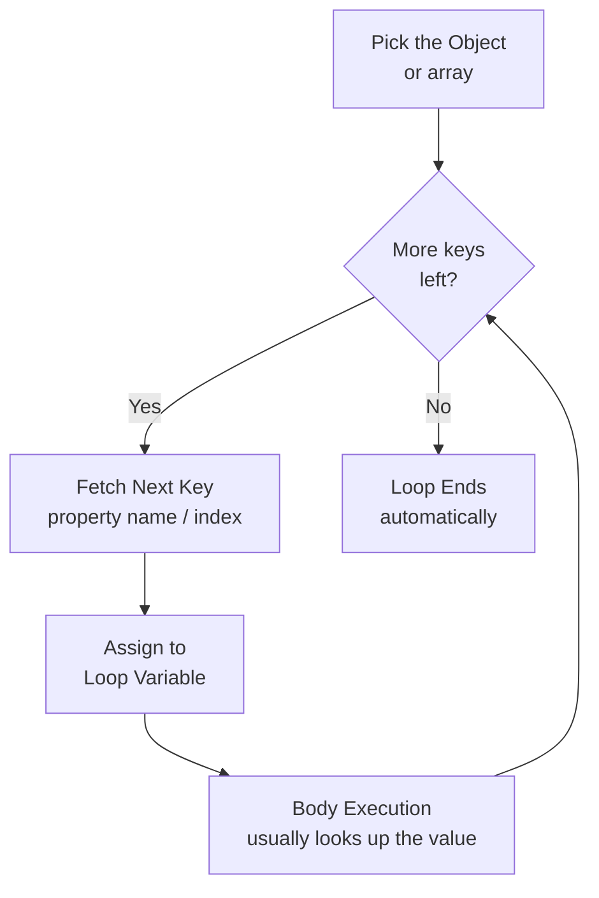
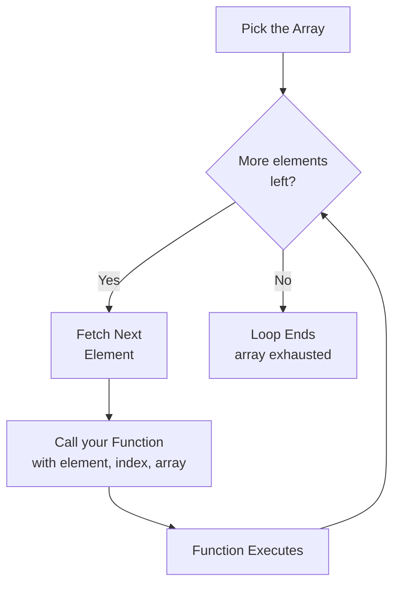
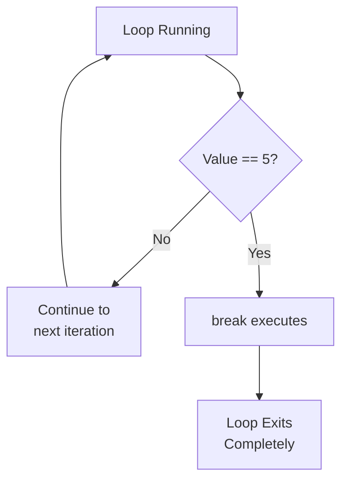
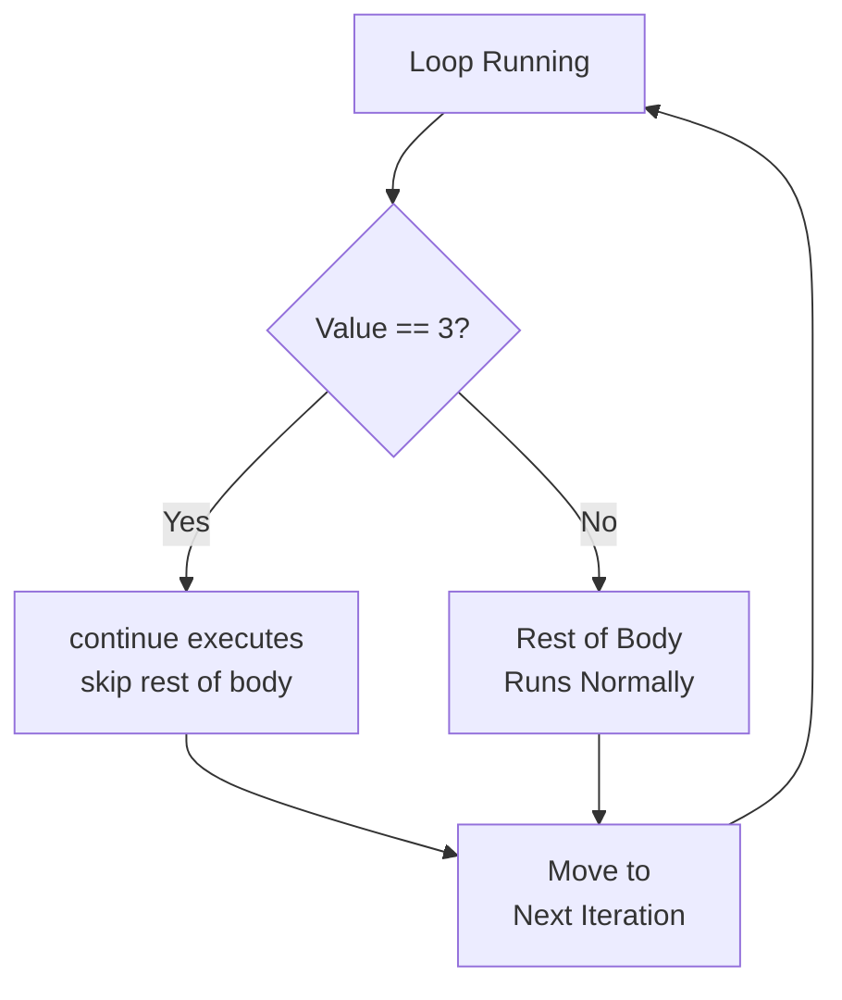

# Loops in TypeScript — A Tutor's Guide

As your TS tutor, let's break down loops conceptually first — the "types" (as in `number`, `string`, etc.) are a separate topic, so this guide stays focused purely on **how loops work and when to use each one**.

## What is a Loop?

A loop is a control-flow mechanism that repeats a block of code until a certain condition is no longer true, or until you've iterated over every item in a collection. Instead of writing the same line of code 10 times, a loop lets you write it once and control how many times it runs.

Every loop has three core ideas behind it:
1. **A starting point** — where the loop begins
2. **A condition** — checked to decide whether the loop should continue
3. **A change/step** — something that moves the loop closer to stopping (otherwise it runs forever — an "infinite loop")

TypeScript doesn't invent new loop syntax — it uses the same loops as JavaScript, but you'll later learn how to add type annotations to loop variables for extra safety. For now, focus on the *mechanics*.

---

## 1. `for` Loop

**Purpose:** Best when you already know (or can calculate) exactly how many times you want to repeat something.

**How it thinks:** "Start at a value, keep going while a condition is true, and change the value after every round."

It has three parts separated by semicolons:
- Initialization (set up a counter)
- Condition (check before each run)
- Increment/decrement (update after each run)

**When to use:** Counting tasks — like "do this 10 times," or "go through each index of an array."

**Generic Flow:**

---

## 2. `while` Loop

**Purpose:** Best when you *don't* know in advance how many times you'll need to repeat something — you just know the condition that should stop it.

**How it thinks:** "Keep checking a condition *before* running the code. If it's true, run; if false, stop."

**When to use:** Situations driven by an external condition — like "keep asking the user for input until they type 'exit'," or "keep processing until a queue is empty."

**Generic Flow:**

---

## 3. `do...while` Loop

**Purpose:** Same as `while`, but guarantees the code runs **at least once**, because the condition is checked *after* the code executes rather than before.

**How it thinks:** "Run the code first, then check if we should run it again."

**When to use:** When you need guaranteed execution at least once — like showing a menu to a user before checking whether they want to continue.

**Generic Flow:**

*Guarantees the body runs at least once — even if the condition was false from the start.*

---

## 4. `for...of` Loop

**Purpose:** Designed to loop through the **values** inside something iterable — arrays, strings, maps, sets, etc.

**How it thinks:** "Go through this collection, one value at a time, and give me each value directly."

**When to use:** When you care about the actual data/items inside a collection, not their positions. Cleaner and safer than a traditional `for` loop when you just need each element.

**Generic Flow:**

---

## 5. `for...in` Loop

**Purpose:** Designed to loop through the **keys** (property names or indices) of an object or array.

**How it thinks:** "Go through this object, and give me the name of each property (or index), not the value."

**When to use:** When you need to inspect an object's structure — its property names — rather than the array-style data. Less common with arrays since `for...of` is usually cleaner there.

**Generic Flow:**

---

## 6. `forEach` (Array Method)

**Purpose:** Not technically a "loop keyword" like the others — it's a method available on arrays that runs a function once for every element.

**How it thinks:** "For each item in this array, execute this function."

**When to use:** A more modern, functional style of iterating over arrays. It reads cleanly but has less flexibility than `for` (for example, you can't easily `break` out of a `forEach`).

**Generic Flow:**

*No manual condition or increment to manage — it's all handled internally.*

---

## Loop Control Keywords

Two keywords let you interrupt normal loop flow: `break` and `continue`. Let's go from the basics to the finer details of each.

---

### `break`

**Beginner Level**

`break` immediately **stops the loop entirely** — no matter what the condition says — and moves on to the code right after the loop.

Think of it like an emergency exit. The moment you hit `break`, you're out. Nothing else in the loop runs again.

**Example (walkthrough):**
Imagine looping through numbers 1 to 10, and you want to stop as soon as you find the number 5.
- Loop checks 1, 2, 3, 4 → nothing happens, keeps going
- Loop checks 5 → `break` runs → loop stops immediately
- Numbers 6 to 10 are **never even checked**

---

**Intermediate Level**

- `break` works inside `for`, `while`, `do...while`, `for...of`, and `for...in`.
- It only affects the **loop it's directly inside** — the rest of your program continues normally after the loop ends.
- A common use case: **searching** for something. Once found, there's no point checking the rest — `break` saves unnecessary work.
- `break` does **not** work inside `forEach`, since `forEach` is a function call, not a true loop. Trying to "break" out of it will cause an error.

---

**Expert Level**

- **Labeled `break`**: When you have loops nested inside other loops, a plain `break` only exits the *innermost* loop. If you want to exit an *outer* loop directly, you can label it and use `break label;` to jump out of both at once.
- **Common pitfall:** Using `break` skips any code left in that iteration — including cleanup steps you may have expected to run. Always double check nothing important is left after the `break` point.
- `break` is also used in `switch` statements, but that's a separate context from loops — just good to know the same keyword serves double duty.

---

### `continue`

**Beginner Level**

`continue` **skips the rest of the current iteration** and jumps straight to the next round of the loop. Unlike `break`, the loop doesn't stop — it just skips ahead.

Think of it like saying "skip this one, move to the next" rather than "stop everything."

**Example (walkthrough):**
Imagine looping through numbers 1 to 5, and you want to skip printing the number 3.
- Loop checks 1 → prints 1
- Loop checks 2 → prints 2
- Loop checks 3 → `continue` runs → rest of this round is skipped, no print
- Loop checks 4 → prints 4
- Loop checks 5 → prints 5

---

**Intermediate Level**

- `continue` works inside `for`, `while`, `do...while`, `for...of`, and `for...in` — same set as `break`.
- It's useful when you want to **filter out** certain cases without stopping the whole loop — for example, skipping invalid entries while still processing the rest.
- Just like `break`, `continue` does **not** work inside `forEach`.

---

**Expert Level**

- **Watch out with `while` and `do...while`:** if your increment/update step comes *after* the code that `continue` skips, you can accidentally create an **infinite loop**, because the condition never changes. Always make sure the update step runs before or independently of the `continue`.
- **Labeled `continue`**: similar to labeled `break`, in nested loops you can use `continue label;` to skip to the next iteration of an *outer* loop instead of just the inner one.
- `continue` can make code harder to read if overused — many early exits/skips inside a loop can hurt clarity. Use it when it genuinely simplifies logic (like skipping invalid data), not just to avoid an `if/else`.

---

### Quick Comparison

| | `break` | `continue` |
|---|---|---|
| **What it does** | Exits the loop completely | Skips only the current iteration |
| **Loop continues after?** | No | Yes |
| **Works in `forEach`?** | No | No |
| **Typical use case** | Stop searching once found | Skip invalid/unwanted items |

These work with `for`, `while`, `do...while`, `for...of`, and `for...in`, but **not** with `forEach` (since it's a function, not a true loop).

---

## Choosing the Right Loop — Mental Checklist

| Ask yourself... | Use this loop |
|---|---|
| "Do I know exactly how many times to repeat?" | `for` |
| "Am I repeating until some condition becomes false, and I don't know how many times?" | `while` |
| "Must this run at least once no matter what?" | `do...while` |
| "Do I just want each value in a list/array/string?" | `for...of` |
| "Do I want the property names of an object?" | `for...in` |
| "Do I want a clean, functional style for arrays and don't need to `break`?" | `forEach` |

---

## Next Steps

Once you're comfortable with these mechanics, the type layer will click in naturally — you'll just be adding type annotations to the loop variables (like the counter or the array element) for extra compile-time safety.