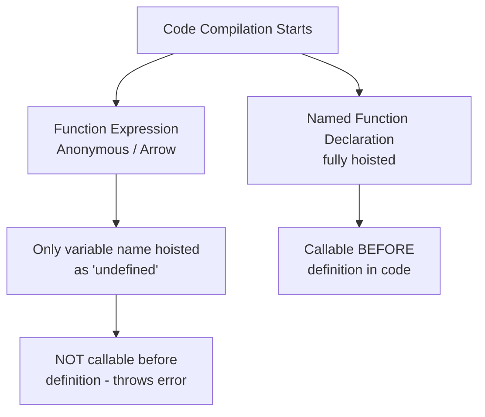
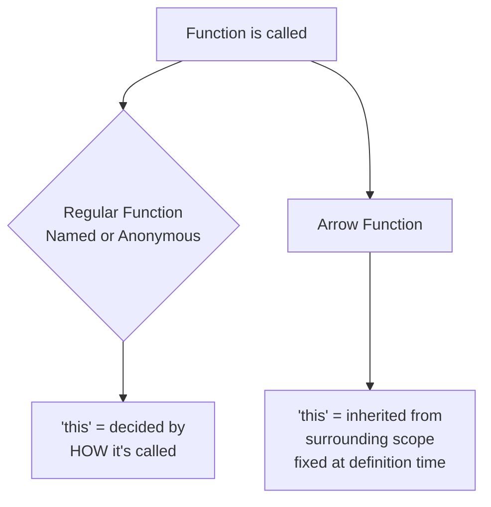

# TypeScript Functions — Interview Prep Guide
### Named Function | Anonymous Function | Arrow Function

---

## 1. Named Function

- A function that has a **name** attached to it, defined using the `function` keyword.
- Can be called **before** its definition in the code (this is called **hoisting** — meaning JavaScript moves the function to the top of its scope before running any code).

```js
sayHello(); // works fine, even though called before definition

function sayHello() {
  console.log("Hello!");
}
```

- You can type the parameters and, optionally, the **return type** — the type of value the function gives back.

```typescript
function sum(a: number, b: number): number {
  return a + b;
}
```

- If you **don't** specify a return type, TypeScript automatically figures it out from the `return` statement (this is called **return type inference**) — you don't always have to write it yourself.

```typescript
function sum(a: number, b: number) {
  return a + b; // TypeScript infers the return type as 'number' on its own
}
```

- Hoisting means the *entire function* (not just its name) is moved to the top of its scope during compilation.
- The name is useful for **readability** and shows up clearly in **stack traces** during debugging (a stack trace is the trail of function calls shown when an error occurs, used to trace where something went wrong).
- Can also be written as a **named function expression** (name + assigned to a variable) — this name is only accessible *inside* the function itself, not outside.

```js
const greet = function sayHi() {
  console.log("Hi!");
};
// greet() works, sayHi() does not — "sayHi" is local to the function
```

- Named functions are preferred for **recursion** (a function that calls itself), since the function can call itself by name reliably, even if the outer reference changes.
- In error/debugging stack traces, named functions show their actual name — anonymous functions show as `anonymous`, which makes debugging harder.
- TypeScript allows **function overloading** (defining multiple valid input/output type combinations for the same function name) only with named functions — not with arrow or anonymous functions.

---

## 2. Anonymous Function

- A function **without a name**, usually assigned to a variable or passed directly as an argument.

```js
const greet = function () {
  console.log("Hello!");
};
```

- **Not hoisted** the same way — since it's a function *expression*, only the variable is hoisted, not the function body. Calling it before definition throws an error.
- Commonly used as **callbacks** (a callback is simply a function passed into another function, to be run later) — e.g., inside `setTimeout`, array methods like `map`/`filter`, event listeners.

```js
setTimeout(function () {
  console.log("Runs after delay");
}, 1000);
```

- Since there's no name, **stack traces are harder to read** during debugging — everything shows as `anonymous`, making it tough to trace which function failed.
- Anonymous functions **have their own `this`** — determined by *how* they're called, not where they're defined (same rule as named functions).
- Often used in **IIFEs** (Immediately Invoked Function Expressions — meaning the function runs immediately as soon as it's defined, instead of being called later) to create isolated scopes.

```js
(function () {
  console.log("Runs immediately");
})();
```

---

## 3. Arrow Function (Lambda)

- A shorter syntax for writing functions, introduced in ES6, using `=>`.
- Like anonymous functions, arrow functions are typically assigned to a variable or passed directly as an argument.

```js
const greet = () => {
  console.log("Hello!");
};
```

- If a function takes **no parameters**, you still write empty parentheses `()` — they can't be dropped.

```js
const sayHi = () => {
  console.log("Hi!");
};
```

- Supports **implicit return** (meaning it automatically returns the result of an expression without needing the `return` keyword) — but only when the body is a **single expression**, written without curly braces.

```js
const add = (a, b) => a + b; // implicitly returns a + b — no braces, no 'return'
```

- For **multi-line logic**, you must use curly braces `{ }` — and inside braces, you need an **explicit `return`** keyword, otherwise the function returns `undefined`.

```js
const multiply = (a, b) => {
  return a * b;   // 'return' is required here, since curly braces are used
};

const broken = (a, b) => {
  a * b;   // ❌ missing 'return' — this function returns undefined, not a * b
};
```

- **Does not have its own `this`** — it inherits `this` from the surrounding (**enclosing scope** — meaning the place in the code where the function was physically written).

- Cannot be used as a **constructor** (a special function used to create new objects with the `new` keyword) — `new MyArrowFn()` throws an error.
- Does **not** have its own **`arguments` object** (a built-in array-like object inside regular functions that holds all the values passed in) — trying to use `arguments` inside an arrow function refers to the outer scope's `arguments` (or throws an error if none exists).
- Not hoisted like function declarations — behaves like any variable assignment.
- Cannot be used as a **generator function** (a special function that can pause and resume itself, producing a sequence of values one at a time using `yield`) — `function*` syntax has no arrow equivalent.
- Commonly used inside **class methods** or **callbacks** specifically to preserve the outer `this` — very useful in React/Angular component code.

```js
class Timer {
  seconds = 0;
  start = () => {
    setInterval(() => {
      this.seconds++; // 'this' correctly refers to the Timer instance
    }, 1000);
  };
}
```

---

## Diagrams

### Hoisting Behavior



### `this` Binding



---

## Comparison Table

| Feature | Named Function | Anonymous Function | Arrow Function |
|---|---|---|---|
| **Hoisted?** | Yes, fully | No (only variable, if assigned) | No |
| **Has own `this`?** | Yes | Yes | No — inherits from scope |
| **Has `arguments` object?** | Yes | Yes | No |
| **Can be used as constructor (`new`)?** | Yes | Yes | No |
| **Shows name in stack trace?** | Yes | No (`anonymous`) | No (unless assigned to a named variable) |
| **Can be a generator (`function*`)?** | Yes | Yes | No |
| **Typical use case** | Reusable, recursive, top-level logic | Callbacks, IIFEs | Callbacks needing outer `this`, concise expressions |

---

## Q&A — Interview Questions & Answers
**Q1. What is the difference between a named function and an anonymous function?**

A:
- A named function has an identifier and can be called before its definition due to hoisting.
- An anonymous function has no name, is usually assigned to a variable or passed as a callback.
- Anonymous functions are not hoisted the same way — only the variable is hoisted.

**Q2. How do you write an arrow function that adds two numbers?**

A:
- `const add = (a, b) => a + b;`
- This uses implicit return since the body is a single expression — no `return` keyword or curly braces needed.

**Q3. How do you specify a function's return type in TypeScript?**

A:
- Add `: type` after the parameter list, before the curly braces.
- Example: `function sum(a: number, b: number): number { return a + b; }`.
- This tells TypeScript exactly what type the function must return.

**Q4. What happens if you don't specify a return type on a function?**

A:
- TypeScript does not throw an error or fail to compile.
- It automatically infers the return type based on the function's `return` statement.
- This is called return type inference — writing the type explicitly is optional, not required.

**Q5. Can an anonymous function be called before it's defined in the code?**

A:
- No.
- Since it's a function expression, only the variable is hoisted (as `undefined`), not the function body.
- Calling it early throws an error.

---

**Q6. How do you write a multi-line arrow function, and how is it different from a single-line one?**

A:
- A multi-line arrow function needs curly braces `{ }` around the body.
- Inside curly braces, you must use an explicit `return` keyword to send back a value — it's not automatic.
- A single-line arrow function (no braces) returns its expression's result implicitly, without needing `return`.
- Example: `(a, b) => { return a * b; }` needs `return`; `(a, b) => a * b` does not.

**Q7. How do you write a function with no parameters?**

A:
- Keep the parentheses empty — they can't be omitted.
- Example (arrow): `const sayHi = () => { console.log("Hi!"); };`
- Example (named): `function sayHi(): void { console.log("Hi!"); }`

---

**Q8. Why do arrow functions not have their own `this`?**

A:
- By design, arrow functions don't create their own `this` binding.
- They inherit `this` from the enclosing lexical scope at the time they're defined.
- This is different from regular functions, where `this` depends on how the function is called.

**Q9. What happens if you try to use `new` with an arrow function?**

A:
- It throws a `TypeError`.
- Arrow functions cannot be used as constructors since they lack their own `this` and prototype.

**Q10. Why might a named function be preferred over an anonymous one for recursion?**

A:
- A named function can reliably call itself by its own name from within its body.
- This still works even if the outer variable it's assigned to is reassigned or goes out of scope.
- An anonymous function has no such internal reference to call itself by.

---

**Q11. Explain how `this` behaves differently in a regular callback function vs an arrow function callback inside a class method.**

A:
- A regular function callback gets its own `this`, decided by how it's invoked — often `undefined` or the global object in strict mode, causing bugs.
- An arrow function callback doesn't rebind `this` — it keeps `this` from the enclosing class method.
- This means an arrow function correctly refers to the class instance.
- This is why arrow functions are commonly used for event handlers and class properties.

**Q12. Why can't arrow functions be used as generator functions?**

A:
- Generator functions rely on `function*` syntax and the internal mechanics of `yield`.
- These require their own execution context and control flow.
- Arrow functions, by spec, don't support this — there's no `=>*` equivalent.

**Q13. In a large codebase, why might excessive use of anonymous functions make debugging harder — and how would you mitigate it?**

A:
- Anonymous functions show as `anonymous` in stack traces.
- This makes it difficult to pinpoint which function caused an error, especially in deeply nested callbacks.
- Mitigation: assign meaningful names to function expressions (named function expressions).
- Mitigation: extract complex callbacks into separate named functions for clarity and better stack traces.

**Q14. How does TypeScript's function overloading interact with these three function types?**

A:
- TypeScript allows multiple call signatures (overloads) to be declared for named functions.
- This lets you define different parameter/return type combinations for the same function name.
- Arrow functions and anonymous functions assigned to variables don't support this traditional overload syntax directly.
- Instead, you'd need to type the variable itself with a union of call signatures.

